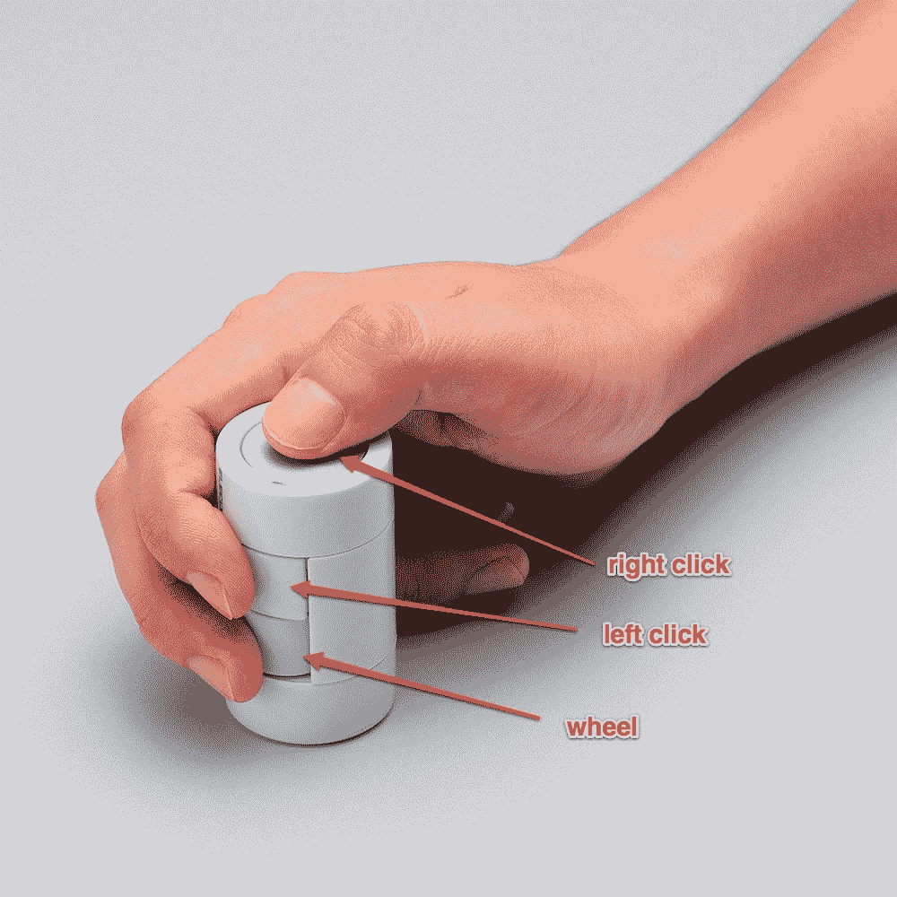
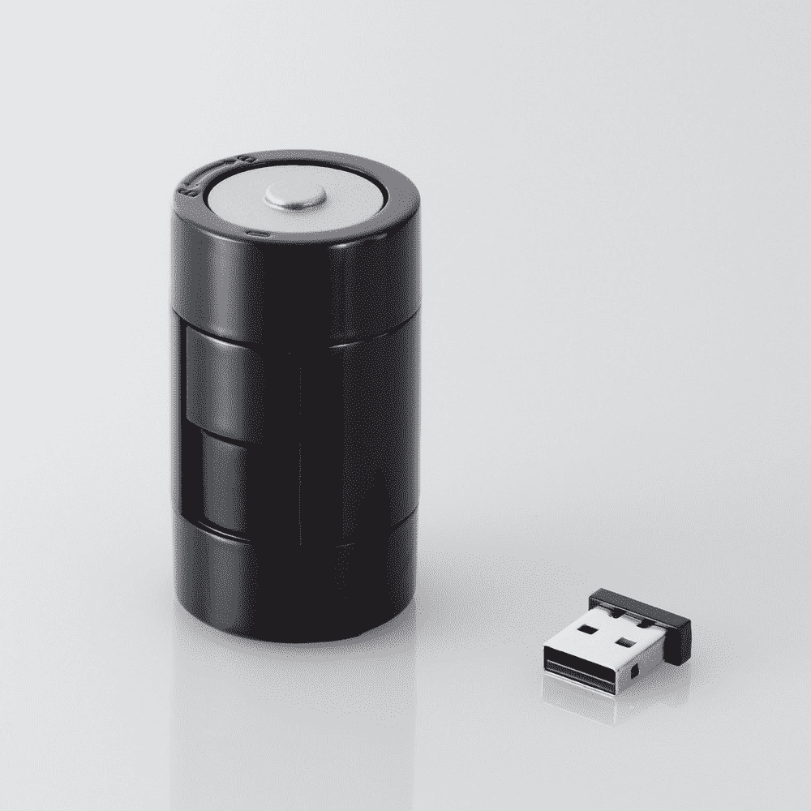

# kandenchi:看起来像电池的设计师鼠标 

> 原文：<https://web.archive.org/web/http://techcrunch.com/2011/08/23/kandenchi-designer-mouse-that-looks-like-a-battery/>

# kandenchi:看起来像电池的设计师鼠标

日本配件制造商 [Elecom](https://web.archive.org/web/20230204095323/http://www.elecom.co.jp/global/) [今天发布了](https://web.archive.org/web/20230204095323/http://www2.elecom.co.jp/peripheral/mouse/m-ne5dl/index.asp)【JP】*kanden chi*，一款设计像电池的无线鼠标。这款 2.4GHz 的设备是与东京设计公司 [nendo](https://web.archive.org/web/20230204095323/http://www.nendo.jp/en/) 合作开发的，可以通过 USB 连接到你的电脑。

从技术上来说，kandenchi 实际上是一个传统的三键鼠标，兼容 Windows XP/Vista/7 和 Mac OS X 10.5 及更高版本。

下面是买家使用鼠标的方式(Elecom 只使用宣传图片，显示人们用右手拿着鼠标，但我想这对左撇子也适用):

Elecom 计划 10 月份开始在日本销售 kandenchi，售价 65 美元。如果你感兴趣，但住在日本以外，可以问问专门的在线商店，比如 [Geek Stuff 4 U](https://web.archive.org/web/20230204095323/http://www.geekstuff4u.com/) 。