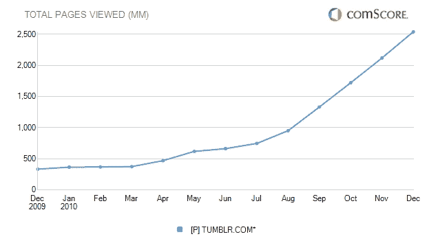

# 戴维·卡普:“Tumblr 每周增长 2.5 亿次浏览量”

> 原文：<https://web.archive.org/web/https://techcrunch.com/2011/01/28/karp-tumblr-quarter-billion-impressions-week/>

# 戴维·卡普:“Tumblr 每周增加 2.5 亿次浏览量”

Tumblr 像杂草一样生长，但“过去的四五个月完全盖过了之前的一切，”创始人戴维·卡普在今天为 TCTV 录制的一段视频中告诉克里斯·迪克森。“我们每周增加 2.5 亿次展示，”他透露。上周，Tumblr 的浏览量达到了 12 亿次，而每周 T2 的浏览量还会增加 2.5 亿次。请想一想。在过去的 30 天里，浏览量达到了 42 亿次。

如果你想知道为什么 Tumblr 最近有如此多的[宕机](https://web.archive.org/web/20230202232648/https://techcrunch.com/2011/01/18/why-is-tumblr-down/)，看看下面的 comScore 图表，它显示了自己对 12 月份 25 亿次页面浏览量的估计，高于去年的 3.35 亿次。根据 comScore 的数据，所有这些都来自全球每月 1900 万的独立访客。(卡普的数据是基于他自己的内部谷歌分析，而且他们的时间段略有不同，他还指出，Tumblr 直接向 [Quantcast](https://web.archive.org/web/20230202232648/http://www.quantcast.com/tumblr.com) 报告)。

卡普承认，该公司对这种曲棍球棒式的高速增长“毫无准备”，但随着新的一轮 3000 万美元的银行存款，他说他的团队正在夜以继日地工作，以保持规模并赶上所有突然的需求。卡普说，增长部分来自大学生，他们只是从 2009 年 9 月左右才真正开始使用这项服务，最近，欧洲、日本和巴西的国际增长也是如此。他还单独告诉我，65%的浏览量来自于 Tumblr 用户查看他们的仪表盘(显示了他们关注的 Tumblr 上其他人的帖子流)。

上面的视频摘自克里斯·迪克森(Chris Dixon)为他的 TCTV 节目*创始人故事*(之前的*初创公司夏尔巴人*)所做的一段较长的对话。下周我们将发布更多的摘录和完整的采访，卡普在采访中解释了为什么他最尊敬的两个人是史蒂夫·乔布斯和威利·旺卡。

**更新**:观看本次采访的[第一部](https://web.archive.org/web/20230202232648/https://techcrunch.com/2011/02/21/founder-stories-why-david-karp-started-tumblr-blogs-dont-work-for-most-people/)、[第二部](https://web.archive.org/web/20230202232648/https://techcrunch.com/2011/02/22/founder-stories-karp-tumblr-making-money/)、[第四部](https://web.archive.org/web/20230202232648/https://techcrunch.com/2011/02/24/founder-stories-tumblr-karp-jobs-wonka/)。

