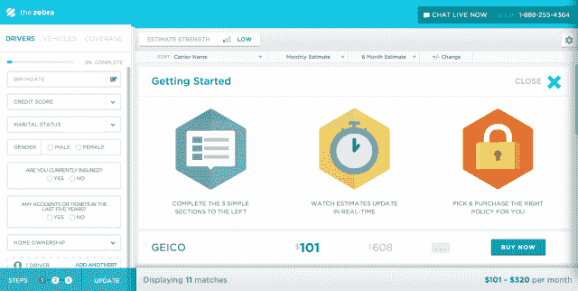

# 汽车保险网站 Zebra 的 Kayak 又获得 300 万美元，在全国范围内推出 

> 原文：<https://web.archive.org/web/https://techcrunch.com/2013/12/10/kayak-for-auto-insurance-site-the-zebra-grabs-another-3m-launches-nationwide/>

总部位于奥斯丁的保险公司斑马公司已经完成了 450 万美元的种子期投资，其中包括来自英国 Moneysupermarket.com 创始人 Simon Nixon 和现有投资者的 300 万美元投资。尼克森与马克·库班、小迈克·梅普斯(Mike Maples Jr .)、伯奇米尔实验室(Birchmere Labs)等人一起支持这家初创公司，其目标是成为“汽车保险的皮划艇”也就是说，在斑马上，用户可以匿名购买保险，比较实时提供的各种报价。

该公司首先于今年 9 月在 T4 向公众推出了 T5 服务，最初目标是拥有最多司机的加利福尼亚州和得克萨斯州。今天，斑马已经向美国各州寻求汽车保险的司机敞开了大门。

司机可以在其平台上比较 204 家公司，包括 22 个更大的品牌，包括 Esurance、Travelers、The General 和该公司不能公开披露的其他品牌。

首先，用户需要完成一份简短的在线问卷，问卷开始时非常简单，只需输入汽车和邮政编码。然后，随着他们继续回答更多问题，他们会看到他们的报价变得更加准确和精确，这一过程只需一分钟左右。

为了生成报价，该公司使用公共数据(公共费率申报文件)和保险公司直接提供的数据相结合——前者试图为斑马公司尚未建立关系的公司逆向设计汽车保险定价。

自推出以来，该公司的收入实现了 120%的月环比增长，这主要来自于通过电话销售的保单。然而，斑马现在正致力于直接集成，这将允许司机在线购买他们的政策。根据创始人兼首席执行官 Adam Lyons 的说法，自 9 月份试运行以来，Zebra 已经提供了超过 100 万份报价，今天覆盖了整个汽车保险市场的 85%以上，在所有州有 1，751 种保险产品。

至于延长种子期，他说，这实际上只是引入西蒙·尼克松(Simon Nixon)的一种方式，而不是开启首轮融资。“每个现有的投资者都参与了，但我们想为西蒙腾出空间，因为他很棒，”莱昂斯说，并指出尼克松如何帮助大型比较网站 moneysupermarket.com 上市，现在正押注斑马公司在美国市场采取同样的做法。

更正:尼克森不是另外 300 万美元的唯一投资者，但却是此轮投资中唯一的新投资者。这篇文章已被修改以澄清这一点。