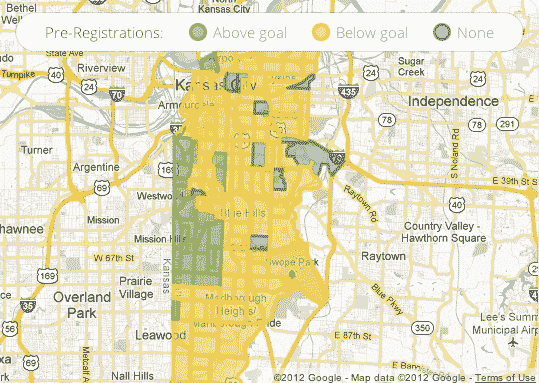

# 谷歌光纤:密苏里州堪萨斯城 20%的社区已经实现了注册目标 

> 原文：<https://web.archive.org/web/https://techcrunch.com/2012/07/29/kc-google-fiber-threshold-20-percent/>

# 谷歌光纤:密苏里州堪萨斯城 20%的社区已经实现了他们的注册目标

真快。就在几天前，谷歌正式开放了在堪萨斯城的堪萨斯和密苏里州推出的 1 千兆光纤网络的注册。仅仅两天之内，密苏里州 20%以上符合条件的居民区已经达到了谷歌为他们的“光纤社区”提供超高速光纤网络的门槛,还有相当多的居民只需注册几次就能达到目标。

然而，在堪萨斯州的堪萨斯城，事情进展得没有那么快，那里的家庭收入中值明显低于城市的另一边。到目前为止，只有三个社区达到了谷歌的目标，许多社区距离达到谷歌的入户光纤门槛还有数百个签约用户。

【T2

当谷歌上周正式推出谷歌光纤时，它建立了一个不同寻常的系统来决定首先在哪里推出它:该公司将大都市地区分成 250-1500 户家庭的“光纤社区”，潜在用户必须预先注册光纤服务，收取 10 美元的费用。在谷歌开始铺设光纤之前，这些社区中的每一个都需要达到一定的注册家庭门槛(通常在 5%到 25%之间)。在 9 月 9 日之前没有达到预登记目标的社区将排在最后，那些达到目标的社区将根据每个地区的预登记总数进行优先排序。

目前领先的 fiberhood 是 [Wornall Homestead](https://web.archive.org/web/20230119131627/https://fiber.google.com/cities/kcmo/#header=check&fiberhood=knssmoccdf09) ，17%的家庭已经注册(谷歌的门槛是 10%)。

为了让光纤首先进入他们的社区，一些人决定他们不想听天由命。 [Zaarly](https://web.archive.org/web/20230119131627/http://zaarly.com/) 首席执行官 Bo Fishback，举例来说，正在利用他自己的服务雇佣一名“[谷歌光纤上门推销员](https://web.archive.org/web/20230119131627/http://www.zaarly.com/listings/5011810eca45c03fb50005b5)”，他可以在他的社区挨家挨户敲门，以确保有足够多的人预先登记。菲什贝克还会支付邻居的预注册费。

正如我们的 Ryan Lawler [昨天指出的那样](https://web.archive.org/web/20230119131627/https://techcrunch.com/2012/07/28/google-fiber-devils-advocate-bitches/)，第一个谷歌光纤连接上线还需要一段时间。我们还从一些消息人士那里听说，当地的时代华纳目前正在努力将其客户锁定在多年合同中，以使他们更难转换。堪萨斯城的几个街区还没有一个居民报名。然而，离 9 月 9 日还有 42 天，如果城市两边的大部分社区在那之前都达不到目标，我们会感到非常惊讶。