# KDDI au 在日本发布 12 款新手机 

> 原文：<https://web.archive.org/web/https://techcrunch.com/2008/06/04/kddi-au-releases-12-new-cell-phones-in-japan/>

# KDDI au 在日本发布 12 款新手机

[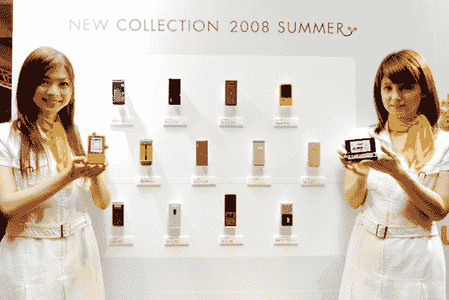](https://web.archive.org/web/20221007033119/https://beta.techcrunch.com/wp-content/uploads/2008/06/au_summer_line_up1.jpg)

日本第二大移动电话运营商 [KDDI au](https://web.archive.org/web/20221007033119/http://www.au.kddi.com/english/) 昨天[紧随 DoCoMo](https://web.archive.org/web/20221007033119/http://www.crunchgear.com/2008/05/27/ntt-docomo-to-roll-out-19-new-cell-phones-in-japan/) 和[软银](https://web.archive.org/web/20221007033119/http://www.crunchgear.com/2008/06/03/softbank-presents-11-new-japanese-cell-phones/)之后，展示了将于今年夏天发布的 12 款新手机。首批型号将于 6 月底出售。

以下是完整的阵容:

日立
的 [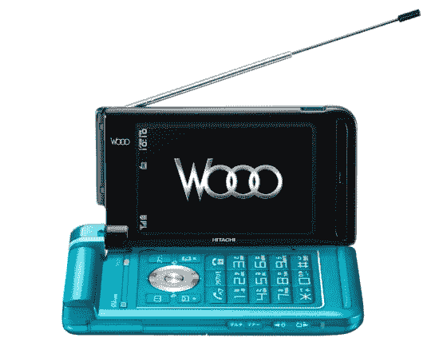](https://web.archive.org/web/20221007033119/https://beta.techcrunch.com/wp-content/uploads/2008/06/w62h1.jpg) 
W62H(配备分辨率为 480×240 的 2.8 英寸有机发光二极管显示屏)
 [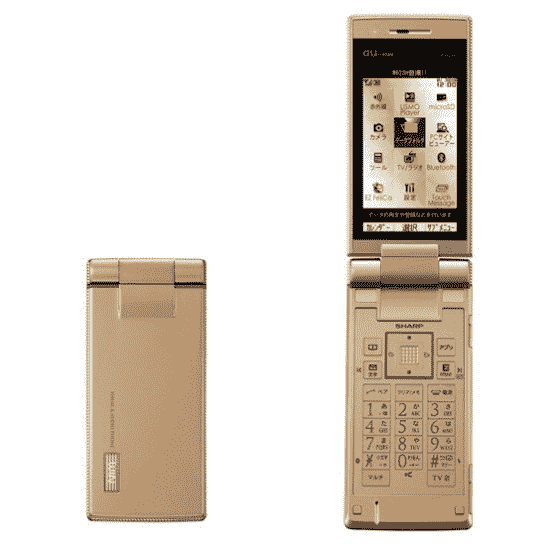](https://web.archive.org/web/20221007033119/https://beta.techcrunch.com/wp-content/uploads/2008/06/w62sh.jpg)
夏普
的 W62SH(配备调频发射机和 3 英寸屏幕)

[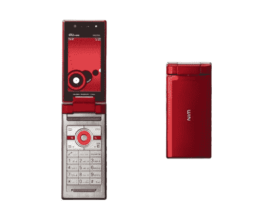](https://web.archive.org/web/20221007033119/https://beta.techcrunch.com/wp-content/uploads/2008/06/w63sa1.jpg) 
来自三洋
的 W63SA(专为环球旅行的商务人士打造的“环球护照 CDMA”)

[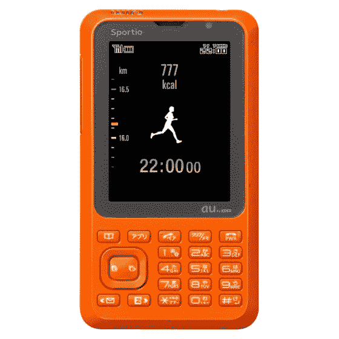](https://web.archive.org/web/20221007033119/https://beta.techcrunch.com/wp-content/uploads/2008/06/w63t.jpg) 
东芝
的 W63T/Sportio(与阿迪达斯合作设计，具有卡路里计数功能)

京瓷
W63K[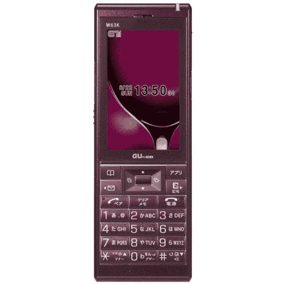](https://web.archive.org/web/20221007033119/https://beta.techcrunch.com/wp-content/uploads/2008/06/w63k.jpg)

[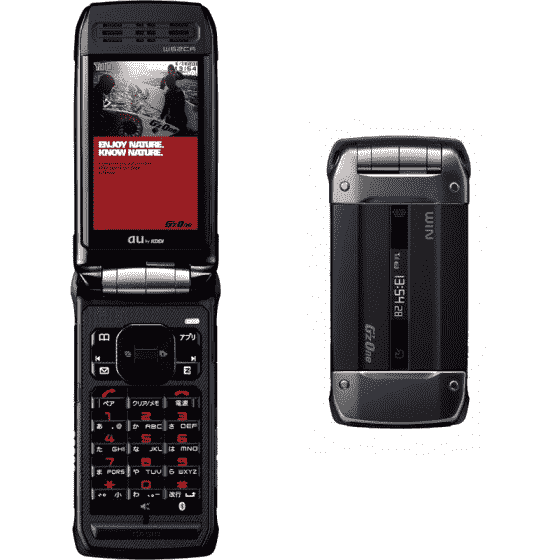](https://web.archive.org/web/20221007033119/https://beta.techcrunch.com/wp-content/uploads/2008/06/w62ca.jpg) 
卡西欧 G 'z One W62CA】(设计用于户外使用，具有防水和超坚固的机身)

[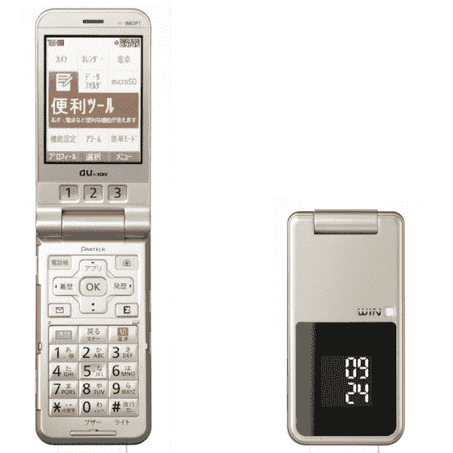](https://web.archive.org/web/20221007033119/https://beta.techcrunch.com/wp-content/uploads/2008/06/w62pt.jpg)
【W62PT】泛泰
(带照明按钮，方便手机操作)

[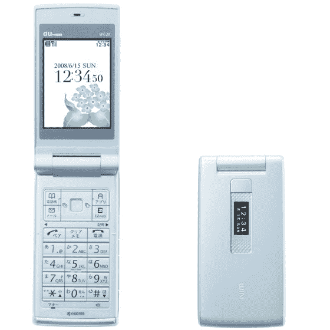](https://web.archive.org/web/20221007033119/https://beta.techcrunch.com/wp-content/uploads/2008/06/w62k.jpg) 
来自京瓷
的 W62K(具有针对 40 岁以上用户的精简功能)

[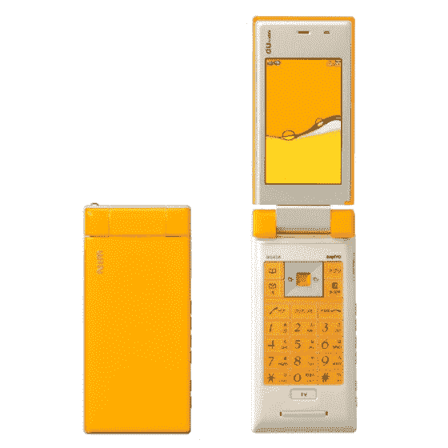](https://web.archive.org/web/20221007033119/https://beta.techcrunch.com/wp-content/uploads/2008/06/w64sa.jpg) 
来自三洋
的 W64SA(面板可以通过“摇动照明”功能闪烁不同的颜色)

[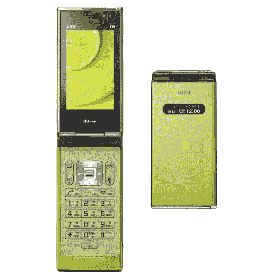](https://web.archive.org/web/20221007033119/https://beta.techcrunch.com/wp-content/uploads/2008/06/w63s.jpg) 
索尼爱立信的 W63S】(在 au 商店更换损坏手机部件的扩展选项)

[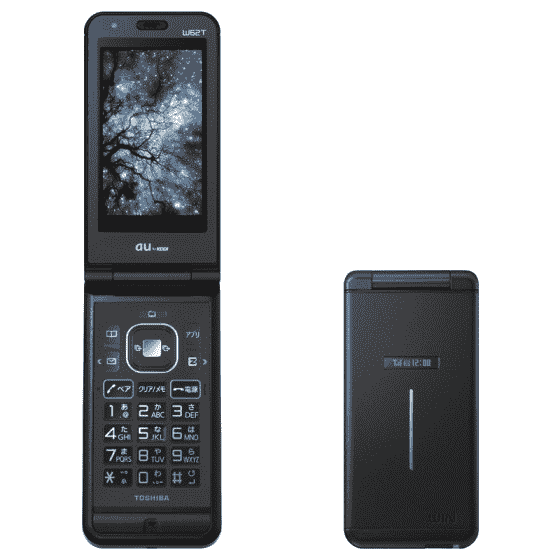](https://web.archive.org/web/20221007033119/https://beta.techcrunch.com/wp-content/uploads/2008/06/w62t.jpg) 
东芝的 W62T
(铝合金面板的标准型号)

[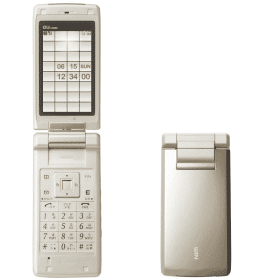](https://web.archive.org/web/20221007033119/https://beta.techcrunch.com/wp-content/uploads/2008/06/w64k.jpg) 
来自京瓷的 W64K
(优化了对单段电视的访问)

除了这个令人印象深刻的阵容，au 还宣布了他们新的“Lismo 视频”服务的开始，通过这项服务，客户可以在他们的手机上播放从 KDDI 的 PC 网站下载的电影。里斯莫音像店【JP】目前有超过 2000 种不同的产品。