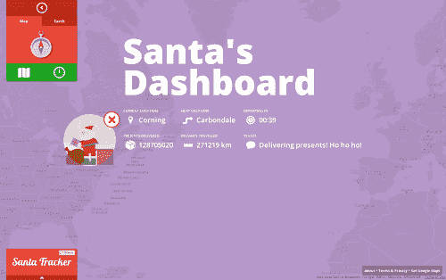

# 用这些谷歌工具追踪圣诞老人 

> 原文：<https://web.archive.org/web/https://techcrunch.com/2012/12/18/keep-track-of-santa-claus-with-these-google-tools/>

# 用这些谷歌工具追踪圣诞老人

北美航空航天防御司令部(NORAD) [可能已经决定放弃谷歌，转而支持微软](https://web.archive.org/web/20230203145213/https://techcrunch.com/2007/12/24/norad-google-maps-santa-tracker/)的官方圣诞老人追踪器，但这个搜索巨头仍在密切关注这个胖子。在平安夜，孩子们和其他任何对这位来自北极的饕餮送礼者的下落有既得利益的人可以使用[谷歌的圣诞老人跟踪器](https://web.archive.org/web/20230203145213/http://google-latlong.blogspot.tw/2012/12/count-down-to-christmas-eve-with-google.html?utm_source=feedburner&utm_medium=feed&utm_campaign=Feed:+blogspot/SbSV+%28Google+LatLong%29&utm_content=Google+Reader)跟踪他的进展。

谷歌今天宣布，它还开发了一个 Chrome 扩展程序,让淘气的孩子和乖孩子同时浏览网页，并关注圣诞老人和他的驯鹿。想听圣诞老人亲口说“嗬嗬嗬”吗？注册一个[定制电话](https://web.archive.org/web/20230203145213/http://www.google.com/santatracker/#/village/santacall)，这是 Gmail 的另一项服务。不幸的是，你只能请求一个电话，所以联系圣诞老人并告诉他把他令人毛骨悚然的小精灵从你的货架上拿下来的唯一方法是通过他的 Gmail 账户联系[。也没有关于谷歌是否会建立骷髅杰克警报的消息。](https://web.archive.org/web/20230203145213/http://www.slate.com/blogs/browbeat/2011/12/23/emailing_santa_claus.html)