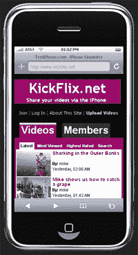

# KickApps 通过视频、格式| TechCrunch 让 iPhone 变得友好

> 原文：<https://web.archive.org/web/http://www.techcrunch.com:80/2007/08/27/kickapps-gets-iphone-friendly-with-video-formatting/>

白牌社交网络平台提供商 KickApps 今天将宣布，它已经采取了两项举措，让 iPhone 用户更容易访问其平台上的社交网络。首先，所有上传到 KickApps 联盟网络的视频都可以在 iPhone 上观看，尽管该设备缺乏 Flash 支持。第二，该公司正在发布开发者工具，将使分支机构能够格式化他们的网络，以便在 iPhone 上显示。

截至 8 月 24 日，KickApps 已经开始自动将上传的视频转换为 Flash 和 QuickTime 格式。在接下来的一个月左右，该公司还将把所有 Flash 视频转换成 QuickTime。当 iPhone 用户试图观看 KickApps 托管的视频时，他或她将获得一个 QuickTime 文件，而桌面客户端将继续加载标准的 Flash 小程序。

虽然从技术上来说，这可能并不难实现，但这是 KickApps 对潜在客户的一个很好的姿态，这些客户看到了其他 Web 2.0 公司——如[脸书](https://web.archive.org/web/20160913211810/http://www.techcrunch.com/2007/08/15/facebook-iphone-ultrahype/)、 [Meebo](https://web.archive.org/web/20160913211810/http://www.techcrunch.com/2007/08/15/most-useful-iphone-site-yet-meebo) 和[Netvibes](https://web.archive.org/web/20160913211810/http://www.techcrunch.com/2007/08/14/netvibes-for-iphone-available-now/)——正在用 iPhone 做的事情，并希望参与其中。作为第一个推出 iPhone 功能的白色标签社交网络平台，它也为该公司赢得了一些吹嘘的权利。

鉴于[苹果可能会在不久的将来为 iPhone 添加 Flash 支持](https://web.archive.org/web/20160913211810/http://mailbox.allthingsd.com/20070705/questions-about-apples-iphone/)，他们关于为 iPhone 格式化 KickApps 网络的第二次声明将具有更持久的意义。该公司现在将允许分支机构为他们的每个网络页面创建两个 CSS 文件:一个用于普通浏览器的页面样式，另一个用于 iPhone。在 JavaScript 片段确定了客户机的浏览环境后，将提供适当的样式表。

KickApps 已经在 KickFlix.net[建立了一个测试网络(如上图),以展示 iPhone 上的格式化和视频播放是如何工作的。虽然不是很漂亮，但这个演示以一种非常适合 iPhone 小屏幕的方式列出了视频和成员。不幸的是，该公司并没有为 iPhone 格式化真正的视频和会员页面。这个疏忽让我想知道，对于分支机构来说，创建 CSS 文件使他们所有的网络页面适应 iPhone 有多容易。](https://web.archive.org/web/20160913211810/http://www.kickflix.net/)

虽然这些产品感觉有点像 KickApps 急于让他们离开，但很高兴看到他们在[高度拥挤的](https://web.archive.org/web/20160913211810/http://www.techcrunch.com/2007/08/14/34-more-ways-to-build-your-own-social-network/)白色标签社交网络领域处于领先地位。让我们希望其他像宁这样的公司也能效仿。

关于 KickApps 的更多报道，请参见我们最近关于 DIY、托管社交网络解决方案的综述。