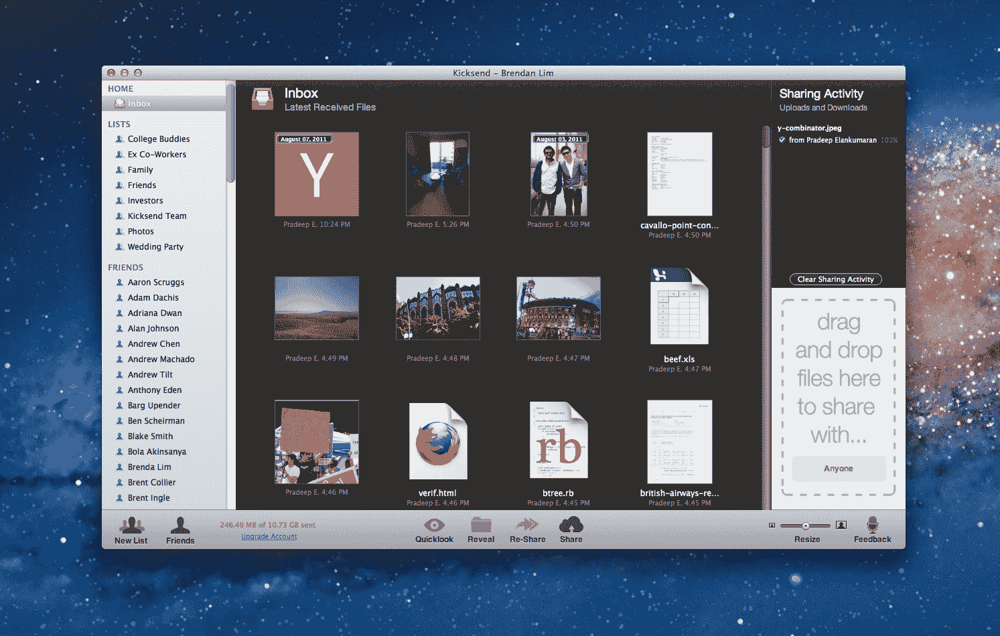

# Kicksend 从 True Ventures、SV Angel & More 获得 180 万美元用于简单文件共享 

> 原文：<https://web.archive.org/web/https://techcrunch.com/2011/11/03/kicksend-grabs-1-8-million-from-true-ventures-sv-angel-more-for-dead-simple-file-sharing/>

# Kicksend 从 True Ventures、SV Angel & More 获得 180 万美元用于简单文件共享

8 月，Y Combinator grad [Kicksend](https://web.archive.org/web/20230203093036/http://kicksend.com/) 推出测试版，让发送和分享大文件变得轻而易举，尤其是对非技术人群而言。([在这里阅读我们最初的报道](https://web.archive.org/web/20230203093036/https://techcrunch.com/2011/08/08/y-combinator-backed-kicksend-launches-in-beta-to-make-sharing-big-files-a-breeze/)。)从那以后，创始人帕拉德普·伊兰库马兰和布伦丹·林告诉我，他们一直在埋头修正、调整和开发一些大的新功能。虽然这些还没有准备好播出，但这家初创公司今天宣布，它已经筹集了 180 万美元的种子资金。

种子轮由 [True Ventures](https://web.archive.org/web/20230203093036/http://www.crunchbase.com/financial-organization/true-ventures) 领投，参与方有 [Digital Garage](https://web.archive.org/web/20230203093036/http://www.crunchbase.com/company/digital-garage) 、 [SV Angel](https://web.archive.org/web/20230203093036/http://www.crunchbase.com/financial-organization/sv-angel) 、 [Start Fund](https://web.archive.org/web/20230203093036/http://www.crunchbase.com/financial-organization/start-fund) 以及 Milo 创始人兼 CEO [Jack Abraham](https://web.archive.org/web/20230203093036/http://www.crunchbase.com/person/jack-abraham) 。Kicksend 将利用新资本来壮大团队，并推出几项对其文件共享服务的重大改进。

尽管创始人表示，他们已经看到许多企业使用该网站分享和发送文件，但 Kicksend 仍然专注于消费者，特别是创造一种简单、直观的用户体验，甚至连你的祖母都可以使用。迄今为止，这项服务在网上和桌面上都可以使用，但移动应用程序正在发展中。

对于那些不熟悉这项服务的人来说，Kicksend 的价值主张既在于它的简单性，也在于它的平台是实时连接的，用户可以从桌面应用程序中拖放大量文件，并立即将它们发送到收件人的桌面和网络应用程序、收件箱(很快)以及移动应用程序中。

更重要的是，与其他文件共享媒体相比，Kicksend 没有大小限制，是私有的，可以轻松地异步工作(不像 IM)。与同步备份解决方案相比，该服务无需共享文件夹和权限。

对于那些希望毫不费力地发送大量文件的人来说，这是一个很棒的工具，而且有一些知名风投的支持，肯定会有更多有趣的东西出现。

在这里查看 [Kicksend 主页](https://web.archive.org/web/20230203093036/http://kicksend.com/)，或者在这里阅读我们的[完整发布报道](https://web.archive.org/web/20230203093036/https://techcrunch.com/2011/08/08/y-combinator-backed-kicksend-launches-in-beta-to-make-sharing-big-files-a-breeze/)。
