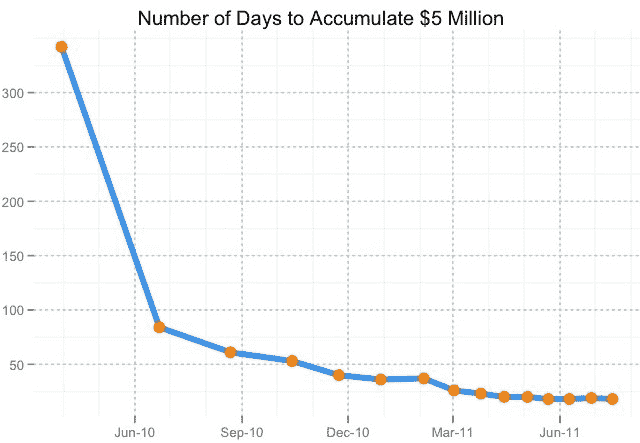

# Kickstarter 庆祝其第 10，000 个成功项目和 7500 万美元的认捐 

> 原文：<https://web.archive.org/web/https://techcrunch.com/2011/07/19/kickstarter-celebrates-its-10000th-successful-project-and-75m-in-pledges/>

# Kickstarter 庆祝其第 10，000 个成功项目和 7500 万美元的认捐

众筹网站 [Kickstarter](https://web.archive.org/web/20230127211149/https://techcrunch.com/tag/kickstarter/) 今天为[发布了一个有趣的回顾帖](https://web.archive.org/web/20230127211149/http://www.kickstarter.com/blog/10000-successful-projects)，以纪念他们第 10，000 个成功资助的项目(如果你好奇的话，一个俄亥俄州乐队[组合了一个 7”](https://web.archive.org/web/20230127211149/http://www.kickstarter.com/projects/nickhamm/citizen-is-releasing-a-7-record))。当联合创始人 Yancey Stickler 和一些成功的项目创作者走上 Disrupt NYC 的舞台时，我们对其中一些数字(或他们的前辈)有所了解，但现在他们以图表和博客的形式出现在这里，供那些错过小组讨论的人使用。

该网站的发展令人瞩目:上个月，它资助的项目数量与第一年(1044 个)持平。趋势似乎显示一些领域趋于平稳，但这可能不是一件坏事。

相比更受欢迎的媒体项目，我们更倾向于寻找与技术相关的项目(今天我发布了华丽的 [Pen Type A](https://web.archive.org/web/20230127211149/https://techcrunch.com/2011/07/19/kickstarter-pen-type-a-for-the-minimalist-pen-lover/) )，所以我们对网站的看法有点倾斜:我们看到的东西往往是更昂贵、更少资金的一端，因为它们往往需要原型制作、制造和包装。但是绝大多数的项目实际上都是音乐和电影。时尚和游戏与科技一样垫底，或许是因为它们倾向于寻找其他的发展途径。

一幅生动的图表显示了实现 500 万美元认捐所需天数的减少:

如你所见，已经触底了。这种展示的稳定增长会产生递减的回报，因为如果他们想把这个数字从 23 减少到 20，需要相当多的人。这张图表显示了成功资助的项目的突然高峰(注意，这些图表指的是不同的时间段，所以不要通过垂直排列得出任何结论):

这可能有很多原因，尽管 Strickler 和 Benenson(这篇文章的作者)没有给出解释。我大胆猜测，他们的员工和布局已经达到了效率上限。每天有超过 300 个项目被提交(根据 Strickler 在五月份的说法)，批准和监控它们不仅仅是一项全职工作。有可能网站的组织方式不能有效地扩展到超过这个项目量(像应用程序和杂货店，在某些时候选项的多样性使找到你想要的东西变得更加困难*)，但也可能是他们透露的数据范围之外的另一个原因。*

 *Kickstarter 是否试图恢复去年的大幅增长，或者是否决定简化并使其成为一种更有规划的体验，完全取决于他们。不管怎样，我都喜欢；我不支持为了增长而增长。接下来的一年对他们来说应该是有趣的一年。

最后，看看这段令人瞠目结舌的视频，它展示了所有 10，000 个成功项目的页面:

【YouTube = http://www . YouTube . com/watch？v = rent 5 xhreqw & w = 640 & h = 390]*