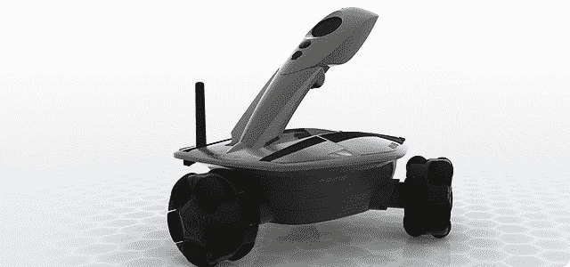

# Kickstarter:基于脑电图的远程呈现机器人控制器 

> 原文：<https://web.archive.org/web/http://techcrunch.com/2011/08/18/kickstarter-eeg-based-telepresence-robot-controller/>

# Kickstarter:基于脑电图的远程呈现机器人控制器

你可能对一两个远程呈现机器人很熟悉。我们甚至在 TechCrunch 的办公室里放了一个。它们通常有相当简单的导航界面:前进、后退、左转、右转，以及一些对摄像头和扬声器的控制。问题是这些控件通常是通过传统方式访问的:键盘、鼠标或手持控制器。远程呈现的一个主要应用是让那些不能自己行动的人可以虚拟地行动。行动极其受限的人往往无法可靠地使用他们的手指或四肢，因此[使用头部倾斜、吹气和吮吸的定制系统](https://web.archive.org/web/20230204131103/https://techcrunch.com/2011/06/14/engineer-has-been-helping-paraplegic-gamers-play-using-modified-controllers-for-30-years/)以及[眼球追踪](https://web.archive.org/web/20230204131103/https://techcrunch.com/2010/12/13/video-eyewriter-2-0-eye-tracking-hardware/)是必要的。

罗伯特·奥斯克勒是一名机器人和远程呈现爱好者，多年来一直在制作自己的软件。他的 [Robodance](https://web.archive.org/web/20230204131103/http://robodance.com/index.php) 客户端的最新版本增加了对 [EPOC](https://web.archive.org/web/20230204131103/http://www.emotiv.com/) 脑电图监测 PC 外设的支持，他希望在 [Kickstarter](https://web.archive.org/web/20230204131103/http://www.kickstarter.com/projects/robots/robodance-5-telepresence-robotics-for-all-esp-the) 上获得一点支持。这难道不值得花点钱吗？

他已经为此买单很长时间了，我猜这个版本的成本开始增加。他的软件支持许多机器人，但不支持许多专用的远程呈现机器人，这些机器人通常有自己的私人客户端。不幸的是，Oschler adores 机器人在亚马逊上的评论似乎相当糟糕，但如果其他机器人被医疗机构选中，那么没有理由不让该软件支持其他机器人。

最后，我认为这只是一个有价值的项目，最终可能会以一种非常真实的方式帮助一些人。我宁愿这个人在他的探索过程中得到帮助，而不是，比方说，某个人又做了一个 iPad 保护套。点击这里查看 Kickstarter 项目。