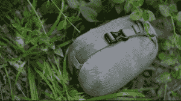

# Kickstarter: Kammok，户外运动者和城市人的吊床 

> 原文：<https://web.archive.org/web/http://techcrunch.com/2011/08/26/kickstarter-kammok-a-hammock-for-outdoorsmen-and-city-folk-alike/>

# Kickstarter: Kammok，户外运动者和城市人的吊床

过去，人们对极客的看法是，我们住在黑暗的房子里，不停地俯身看着电脑，永远见不到阳光。老实说，我年轻的时候也是这样，但是这些天我开始更喜欢户外运动了。

尽管如此，我对新鲜空气的热爱只能与我对闲逛的热爱相匹配，而且 Kammok 听起来非常适合我的理想生活方式。

kam mok 是一种轻便的便携式吊床，其主要的名声来自它的新月形织物。这是一种透气、抗撕裂的尼龙面料，可以在夏天的三伏天让冷空气进来，同时在天气变冷时保持热量。整个袋子装在一个轻便防水的袋子里，只有大约一磅重。

虽然它对所有户外运动者都有一些非常明显的用途，但 Kammok 团队坚持认为，他们的产品对城市居民和大学生来说就像在森林空地上一样有能力。用户只需将 Kammok 的“蟒蛇带”绕在两个附近能支撑你体重的支撑物上，将特制的钩扣扣到位，然后*瞧*，几分钟后你就可以坐好了。

Kammok 的售价为 85 美元，对它来说有点贵，但有超过 1400 名支持者，需求似乎很充足。Kammok 团队还承诺，一旦他们完全投入运营，未来所有利润的 20%将用于人道主义援助工作。Kickstarter 项目在不到两天的时间里就达到了融资目标，并且已经开始了生产过程，所以我们希望最终产品能够达到团队的要求。