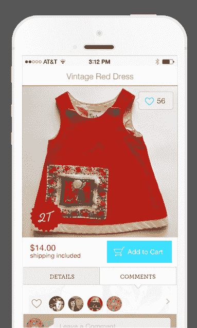

# Kidizen 允许父母通过他们的 iPhones 买卖孩子“以前喜欢的”衣服和其他物品 TechCrunch

> 原文：<https://web.archive.org/web/https://techcrunch.com/2014/02/18/kidizen-lets-parents-buy-sell-kids-pre-loved-clothing-and-other-items-via-their-iphone/>

一个名为 [Kidizen](https://web.archive.org/web/20221007005602/https://www.kidizen.com/) 的新的 iOS 应用正在推出一个移动的点对点市场，允许父母买卖他们孩子的衣服、玩具、鞋子和其他易于运输的配件。该公司承诺，通过向父母提供直接向买家发货的选项，卖家可以保留大约 90%以上的销售价格。这削弱了竞争对手[的威胁](https://web.archive.org/web/20221007005602/http://www.thredup.com/)，目前[为其代表客户转售的服装提供高达 80%的销售价格](https://web.archive.org/web/20221007005602/http://support.thredup.com/entries/23395842-How-much-will-I-earn-for-my-clothing-)。

Kidizen 的想法来自于联合创始人玛丽·法伦和多莉·格拉夫的早期平台 [Itizen](https://web.archive.org/web/20221007005602/http://mergedesignblog.com/2010/11/03/itizen-a-dynamic-new-community-that-blends-the-digital-with-the-analog/) ，该平台于 2010 年推出，专注于跟踪物体从一个人转移到另一个人时所附的故事。该公司最初在那些对艺术、收藏品或其他物品有特定热情的人中间找到了一些吸引力，但该团队很快意识到，用户真正想要的是一个买卖物品的市场，而不仅仅是跟踪物品。

作为父母，法伦和格拉夫决定将 Itizen 的重点转移到“儿童用品”上。

格拉夫解释说，父母们很快就能处理好孩子们的衣服。“孩子在头两年会穿 7 个尺码的衣服，所以随着孩子的成长，我们需要不断地寻找和扔掉这些东西，”她说。虽然今天我们孩子的旧衣服很多都变成了旧衣服或被存放在慈善机构，但这些衣服的一个子集包括父母希望获得某种投资回报的高端物品。

在 Kidizen 上，网站上出售的大部分商品都是高端服装。例如，它的顶级品牌是马蒂尔达简，平均售价为 36 美元。其第二受欢迎的品牌是[珍妮和杰克](https://web.archive.org/web/20221007005602/http://www.janieandjack.com/index.jsp)，售价约为 16 美元。与此同时，低端服装往往会批量出售。

使用该应用程序与针对女性服装买家和卖家的类似市场没有太大区别，比如 ThredUP、Poshmark、Threadflip 或 Twice。您可以查找并关注您喜欢其项目的用户，这些选择将显示在您的订阅源中。如果你选择在网站上出售物品，你需要自己负责包装和运输，而支付处理目前由 PayPal 处理。

但创始人告诉我们，“解决运输障碍”是他们希望在扩大规模时更好解决的问题。

Kidizen 有趣的是，他们正在推出一项服务，很像 2012 年 ThredUP 转向的服务[，希望找到一种可以更好地扩展的模式(到目前为止，它已经做到了)。](https://web.archive.org/web/20221007005602/https://beta.techcrunch.com/2012/03/08/thredup-shuts-down-kids-clothes-swapping-service-in-favor-of-online-consignment/)

是否 [Kidizen](https://web.archive.org/web/20221007005602/https://www.kidizen.com/) 会变得类似的停滞不前还有待观察。然而，像这样的服务存在的时机更好——许多女装创业公司和市场[已经](https://web.archive.org/web/20221007005602/https://beta.techcrunch.com/2013/11/21/twice-brings-its-secondhand-clothing-marketplace-to-ipad/) [到来](https://web.archive.org/web/20221007005602/https://beta.techcrunch.com/2013/05/30/re-commerce-gets-a-revamp-with-threadflips-new-iphone-app-built-for-an-exploding-mobile-audience/)并在移动上蓬勃发展，儿童服装闪购网站 [Zulily 已经 IPO](https://web.archive.org/web/20221007005602/https://beta.techcrunch.com/2013/11/15/zulily-shares-pop-82-above-ipo-price/)，这些公司中的许多公司都提到移动用户群正在增长，如果不是主导的话。

展望未来，Kidizen 将同时应对网络和 Android，但目前它将在 iOS 上推出，此前它已经在几千名用户中进行了测试。首席执行官 Dug Nichols 表示，在这些测试中，这些指标被证明是可靠的，日活跃用户增长 120%(按月环比观察)，会话增长 122%，收入增长 130%。

这家总部位于明尼阿波利斯的五人公司从各种投资者那里获得了少量的天使投资，包括优步的 Emil Michael 等人，但它正在寻求筹集更多的种子资金。

iTunes 上的移动应用程序[可用](https://web.archive.org/web/20221007005602/https://itunes.apple.com/us/app/kidizen/id395245595?mt=8)。

[vimeo 86868575 w=500 h=281]