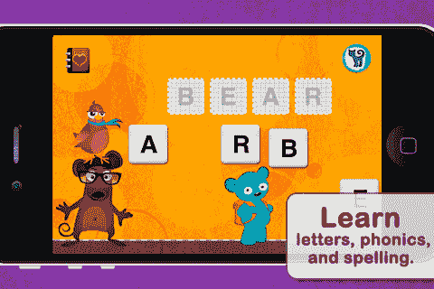

# 儿童应用程序制造商 Duck Duck Moose 从红杉、光速和其他公司获得 700 万美元的 A 轮融资 TechCrunch

> 原文：<https://web.archive.org/web/https://techcrunch.com/2012/09/26/kids-app-maker-duck-duck-moose-raises-7-million-series-a-from-sequoia-lightspeed-others/>

一系列儿童教育应用背后的初创公司 Duck Duck Moose 今天宣布完成了 700 万美元的 A 轮融资，由红杉资本(Sequoia Capital)和光速创投(Lightspeed Venture Partners)牵头，斯坦福大学参与其中。该公司的付费应用程序现已有超过 240 万次下载，仅通过口碑传播就显著提升了其品牌，并在所有 14 个应用程序中赢得了 14 个家长选择奖。这是该非营利组织授予任何应用程序制造商的最高奖项，该组织为满足其质量准则的应用程序、媒体和玩具提供特殊的“批准印章”。

作为一名携带平板电脑的家长，很难不偶然发现鸭鸭驼鹿的一款应用，无论是该初创公司最近的一款应用，如 Trucks HD、公主童话制作人或超级英雄漫画书制作人，还是该公司早期的一款应用，如让孩子跟着经典儿童歌曲一起唱歌的应用，如《巴士上的轮子》或《老麦当劳》。在拥挤的应用商店中，他们往往凭借其优质的设计脱颖而出。但更重要的是，它们是孩子们会反复使用的应用。

【T2

该公司于 2008 年由前 IDEO 公司的 Caroline Hu Flexer、拥有丰富创业经验的丈夫 Michael Flexer 和设计师 Nicci Gabriel 共同创立。这个想法来自于他们自己希望在应用商店中看到高质量的教育内容。“当我的大女儿两岁时，想玩我们的 iPhone，我注意到触摸屏对她非常有吸引力，让她第一次与技术互动，”Caroline 说。“虽然我看到了学习的潜力，但确实没有什么好的教育内容适合小孩子。”

2009 年 1 月，随着第一个应用程序“巴士上的轮子”的推出，当时的四人团队很快就取得了成功。在今年早些时候增加员工之前，他们又制作了 11 个应用程序。现在他们是一个九人团队。此外，他们使用所有原创知识产权和内容，包括图纸、人物、动画甚至音乐，从头开始制作应用程序。(两人都是受过古典音乐训练的音乐家，迈克尔在应用程序的音乐中演奏大提琴，卡罗琳演奏小提琴。)

该公司还与教育工作者和儿童密切合作，测试他们的应用程序，重点是从创意游戏到学习数字和字母。几乎所有的应用程序(iOS 和 Android)都是 1.99 美元一个，只有几个 iPhone 版本是 99 美分，没有一个(谢天谢地)提供应用内购买——这往往破坏了更小的孩子的体验，他们往往会在屏幕上到处点击。

有了额外的资金，该公司将扩大其产品线，包括更多 Android 应用程序的计划，并将完成定制分析和家长报告功能的开发，该功能将监控并向家长报告孩子的进展。该功能尚未上线，但应在未来几周内完成。

该公司还希望利用这笔资金壮大其产品和高管团队，特别是首次雇人负责营销。此外，该计划是最终达到所有的小学市场在未来一年或两年内，成长与他们目前的市场(幼儿到一年级)沿着这条路。

如果你是一个想从汤姆和本的谈话中走出来的家长，你可以从这里下载鸭鸭驼鹿的应用程序。