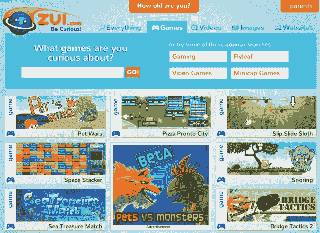

# KidZui 推出“儿童互联网体验”ZUI.com，募集 200 万美元 

> 原文：<https://web.archive.org/web/http://techcrunch.com/2011/08/10/kidzui-launches-zui-com-an-internet-experience-for-kids-raises-2-million/>

# KidZui 推出“儿童互联网体验”项目 ZUI.com，融资 200 万美元

**独家-**[kid zui](https://web.archive.org/web/20230203070312/http://www.kidzui.com/)，一家总部位于加州圣地亚哥的初创公司，为孩子们提供[网络浏览器](https://web.archive.org/web/20230203070312/http://techcrunch.com/2009/11/18/kidzui-browser-kids/)，首次推出其最新产品，一个名为[ZUI.com](https://web.archive.org/web/20230203070312/http://zui.com/)的网站，允许孩子们搜索和探索超过 500 万个父母批准的网站、YouTube 视频、游戏、图像等等。

此外，这家羽翼未丰的公司宣布，它已经从 Mission Ventures、Maveron、Emergence Capital 等风险投资公司获得了额外的 200 万美元资金。KidZui 还得到 Scholastic Corporation 的支持，后者是一家主要的儿童书籍出版商和分销商，也是教育技术和电子商务解决方案的提供商。

KidZui 将 ZUI.com 定位为“3 至 12 岁儿童的搜索和探索引擎”，使孩子们能够发现父母和老师批准的网站、视频、图像和游戏，并通过脸书与父母或其他家庭成员分享他们的经验。

可用内容无处不在，网站在移动设备的浏览器上看起来也应该相当不错。

KidZui 的首席执行官和创始人 Cliff Boro 解释说:“也许只有在 ZUI.com，通过我们建议的搜索词，贾斯汀比伯离 Mozart 只有几下鼠标的距离。”。

该网站对父母和他们的孩子是免费的，由品牌广告支持。而且要明确一点，这是 KidZui 浏览器的扩展，不是替代。

