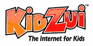

# 被免费 TechCrunch 的力量说服的 KidZui

> 原文：<https://web.archive.org/web/https://techcrunch.com/2008/06/04/kidzui-persuaded-by-the-power-of-free/>

# 被自由的力量说服的孩子

[KidZui](https://web.archive.org/web/20221006202103/http://www.kidzui.com/) 是一款儿童安全浏览器[，将于三月份](https://web.archive.org/web/20221006202103/http://www.beta.techcrunch.com/2008/03/18/kidzui-the-kid-safe-browser/)向那些愿意支付月费(开始 5 美元，之后 10 美元)的用户开放。

这种完全基于订阅的模式(包括 30 天的试用期)有点不寻常，因为如今网络上的大多数消费产品都是免费的，至少对于基础服务来说是这样。SmugMug 是一家声称通过只提供付费订阅而获利颇丰的公司。 [Lumosity](https://web.archive.org/web/20221006202103/http://www.lumosity.com/) (昨天刚刚回顾了)是另一个需要你在 7 天后打开钱包的。哦，还有臭名昭著的《华尔街日报》和《消费者报告》，但是很少有人想到其他的。

不管出于什么原因，KidZui 已经决定放弃这个群体，通过免费提供其产品来加入更广泛的网络——至少是其大部分功能。高级会员资格现在只对那些想要访问一系列扩展功能的用户是必要的，例如内容的额外标签和装饰页面的主题。在育儿方面，付费功能包括更复杂的活动报告和电子邮件更新。这些会员资格已经减半，所以只需每月 5 美元或每年 50 美元。

KidZui 不打算通过广告从免费用户群中赚钱，相反，它表示将坚持主要从付费会员中创收。首席执行官克里夫·博罗告诉我，转向免费模式并不是为了应对艰难的销售；这只是一个更快地解决更多市场问题的决定。情况可能确实如此，但即便如此，这也表明网络上的免费产品版本确实是快速采用的必要条件。

另请参见 [Glubble](https://web.archive.org/web/20221006202103/http://www.glubble.com/) 获得一个[免费方式](https://web.archive.org/web/20221006202103/http://www.beta.techcrunch.com/2007/06/18/glubble-makes-firefox-family-friendly/)来控制 Firefox 中儿童的上网习惯。