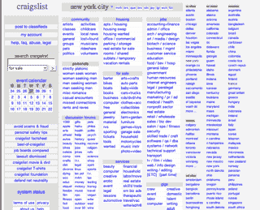
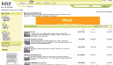

# Kijiji 对 Craigslist 颇有微词:“我们将成为美国第一。”

> 原文：<https://web.archive.org/web/https://techcrunch.com/2008/02/27/kijiji-talks-smack-about-craigslist-we-will-be-no-1-in-the-us/>

 为什么兄弟姐妹就不能好好相处呢？正如我本月早些时候在提到的那样，易贝的免费分类网站 [Kijiji](https://web.archive.org/web/20230126104224/http://www.kijiji.com/) 自去年夏天在美国[推出](https://web.archive.org/web/20230126104224/http://techcrunch.com/2007/07/03/ebay-to-craiglist-game-on-with-us-version-of-kijiji/)以来发展势头强劲。当然，易贝拥有 Craigslist 25%的股份，但由于另外 75%的股份是非卖品，易贝正孤注一掷，与 Craigslist 正面交锋。

根据 comScore 的数据，今年 1 月，Kijiji 拥有 230 万美国访客，这使其成为美国第六大分类广告网站。在六个月的时间里，Kijiji 已经增长到 Craigslist(在美国有 2670 万独立访问者)的 10%。在世界范围内，这些数字更加接近。今年 1 月，Kijiji 的访问量为 2160 万，而 Craigslist 的访问量为 2780 万。

昨天，雅各布·阿克罗来过我的办公室。他是易贝的高管，负责运营 Kijiji 和易贝在世界各地的其他分类网站(包括荷兰的 Marketplaats、西班牙的 Loquo 和英国、澳大利亚、南非和波兰的 Gumtree)。总的来说，Kijiji 在 20 个国家的 700 个城市经营网站。但是 Aqraou 很清楚他想杀谁:

> *我们打必胜。我们将在六个月后赢得美国市场，美国市场是我们最好的市场，我们没有投入任何资金。今年，我们将取得重大进展。我们将成为美国第一*

他没有声称今年会通过 Craigslist，但他给我的印象并不是一个有耐心的人。为什么易贝在 2005 年首先推出 Kijiji？Aqraou 说:

> 我们不相信 Craigslist 的纯英文网站会在国际上取得成功。Craigslist 零本地化。全是英语，跑出旧金山。

这还不是他在 Craigslist 上的唯一问题。他认为这个裸机网站已经失败了:

> *他们变得精简，这让他们可以在没有收入的时候提早行动。这个网站看起来仍然和 12 年前一样。用户期望更多。用户界面、信任度和安全性方面的标准提高了。如果你一动不动，你会被碾死。*

现在，有了收入——广告。这使得鲨鱼进入了 Craigslist 曾经友好的非盈利水域。Kijiji 是易贝发展最快的业务。上个季度，全球收入增长了 104%(易贝不愿透露增长基数)。预计今年易贝方面将进行一次大规模的营销推广，以提高美国 Kijiji 的流量。特色商品收费、网站导航的改进以及更容易上市的工具也将很快推出。

如果你找不到任何东西，一个分类广告网站再漂亮也没用。就你能在每个网站上找到的列表和东西的数量而言——这是成功的最重要的因素——kiji Ji 要赶上 Craigslist 还有很长的路要走。但是 Aqraou 对 Craigslist 的用户界面确实有一点看法。寻找东西很难。不能按价格排序。并且在结果页面中没有图像(仅在单个项目页面上)。

克雷格·纽马克有什么可担心的吗，或者阿克劳只是在说反话？

以下是 Kijiji:

这是 Craigslist 网站:

