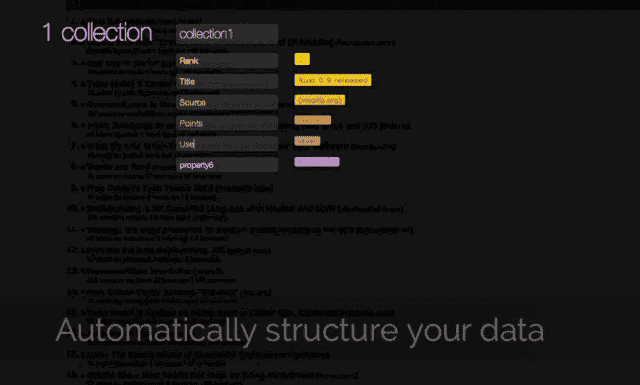

# 和服是一个更智能的网络抓取器，让你“API 化”网络，不需要代码 

> 原文：<https://web.archive.org/web/https://techcrunch.com/2014/02/18/kimono-is-a-smarter-web-scraper-that-lets-you-api-ify-the-web-no-code-required/>

一家由 Y Combinator 支持的名为[和服](https://web.archive.org/web/20221204165811/http://www.kimonolabs.com/)的初创公司希望通过一种点击式工具更容易地从非结构化网络中访问数据，这种工具可以从没有可用 API 的网页中提取信息。对于非开发人员，和服计划最终允许任何人跟踪数据，而根本不需要理解 API。

这种更聪明的“网页抓取器”的想法以前就有人尝试过，但总是难以找到更多的受众。之前尝试过类似的服务比如 [Dapper](https://web.archive.org/web/20221204165811/https://beta.techcrunch.com/2006/08/17/create-an-api-for-any-site-with-dapper/) 或者 [Needlebase](https://web.archive.org/web/20221204165811/http://readwrite.com/2010/11/30/awesome_diy_data_tool_needlebase_now_available_to#awesm=~owfHmuFTlMK5Lm) ，比如[折叠](https://web.archive.org/web/20221204165811/http://www.reporterslab.org/needlebase-dead/)。雅虎 Pipes 仍在继续发展，但公平地说，这项服务早已成为其母公司的重中之重。

但和服的创始人认为，眼下的问题主要是时机。

“越来越多的公司意识到，通过 API 开放他们的一些数据集有很大的价值，允许开发人员建立有趣的应用程序和可视化的生态系统，人们将分享并提高公司的知名度，”和服的联合创始人 Pratap Ranade 说。(他还在《福布斯》的一篇文章[中深入研究了这个问题。但通常，公司不知道如何开始开放哪些数据，或者如何开放。和服可以通知他们。](https://web.archive.org/web/20221204165811/http://www.forbes.com/sites/mckinsey/2014/01/07/ready-for-apis-three-steps-to-unlock-the-data-economys-most-promising-channel/)

此外，Ranade 补充说，和服与 Dapper 或 Needlebase 等早期产品有本质上的不同，因为它输出到 API，并从专注于开发人员用户群开始，未来计划扩展到非技术用户。(与此同时，年龄较大的竞争对手往往正好相反)。

这家公司成立仅一个月，由哥伦比亚大学的校友拉纳德和瑞恩·罗依创建。两人都离开了研究生院去了别处工作，罗去了青蛙设计公司，拉纳德去了麦肯锡。但在将近六年左右的时间里，他们继续各自的职业道路，两人保持联系，一起从事各种小项目。

其中一个是 Airpapa.com，一个告诉你航班上正在上映哪些电影的网站。事实证明，这最终给了他们制作和服的想法。为了获得网站所需的数据，他们不得不从几个公开的网站上搜集数据。

“清理[数据]的整个过程，按计划提取数据……这是一个痛苦的过程，”Rowe 解释道。“我们大部分时间都在做这件事，很少时间花在网站建设上，”他说。与此同时，当 Rowe 在 Frog 时，他意识到该公司有许多非技术设计师，他们需要访问数据来做出有趣的设计决策，但他们没有能力亲自去获取数据。

使用和服，最终目标是简化数据提取，以便任何人都可以管理它。注册后，你在你的浏览器中安装一个书签，点击它，网站进入一个特殊状态，允许你指向你想要跟踪的项目。例如，如果您试图跟踪电影时间，您可以点击电影名称和放映时间。然后，和服的学习算法将建立一个涉及你所选择的项目的数据模型。

这些数据可以被实时跟踪，并以多种方式提取，包括以. CSV 文件的形式导出到 Excel，以电子邮件提醒的形式导出到 RSS，或者对于开发人员来说，作为返回 JSON 的 RESTful API。和服还提供“Kimonoblocks”，让你将数据作为嵌入内容放在网页上，它还提供一个简单的移动应用程序生成器，让你将数据转化为移动网络应用程序。

对于开发者用户，该公司目前正在开发一个 API 编辑器，它允许你将多个 API 合并成一个。

该团队表示，到目前为止，他们对注册人数感到“非常惊喜”，注册人数已经达到 1 万人。尽管只有一个月大，他们已经看到了数以千计的活跃用户。

最初，他们发现硬件黑客做了一些有趣的事情，比如每当有人资助他们的 Kickstarter 活动时就制造一个喇叭，还有那些出于可视化目的使用和服的人，或者监控比特币和 dogecoin 等各种加密货币的汇率。其他人仍在监控数据，这些数据后来被作为 Twitter 机器人发布出去。

和服 API 现在每周进行超过 100，000 次调用，并且使用率每周增长超过 50%。该公司还发布了一个非官方的“索契奥运会 API”来展示这个平台能做什么。

当前的商业模式是基于免费增值，通过[定价](https://web.archive.org/web/20221204165811/http://www.kimonolabs.com/pricing)来实现更高频率的大规模使用。

这家总部位于山景城的公司目前只有两位创始人，并获得了 YC、YC 风投和 SV Angel 的初始投资。

[vimeo 82849382 w=500 h=281]

**更正:Pratap 之前说错了，称注册人数为“数万”“10，000 更准确，帖子已经更新以反映这个数字。*