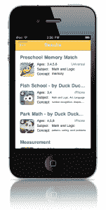

# KinderTown 推出面向家长的教育应用商店 

> 原文：<https://web.archive.org/web/http://techcrunch.com/2011/11/11/kindertown-launches-educational-app-store-for-parents/>

KinderTown 是一个新推出的面向父母的应用商店，提供一系列适合孩子的应用。该商店的独特之处在于，它只包括被认为对三到六岁的孩子具有“实质性教育价值”的应用程序。为了评估应用程序的质量，每个应用程序首先由幼儿教育工作者进行审查，然后在入学前由家长和孩子进行测试。

发布时， [KinderTown 的](https://web.archive.org/web/20230205021009/http://www.kindertown.com/)应用商店是一款通用应用，可以在 iPhone、iPad 和 iPod Touch 上运行。当你启动 KinderTown 时，你可以按平台(iPhone、iPad 或 Universal)、推荐年龄、主题(如数学、语言、艺术、科学等)过滤应用选择。)和价格(免费或付费)。

符合搜索条件的应用会出现在屏幕上，你可以点击它们来查看描述、截图和价格信息。点击“获取应用程序”按钮，你就会进入 iTunes 应用程序商店，开始下载。

KinderTown 的工作人员包括两名负责应用程序审查的前教师。Kay Welch 专门研究早期儿童教育，拥有 20 多年的教学和编写学区课程的经验。Carolina Nugent 做了五年的幼儿园老师，并因其在课堂上整合技术和应用而受到认可。

KinderTown 的概念来自连续创业者和 DreamIt Ventures 的联合创始人史蒂夫·韦尔奇。史蒂夫之前创建了生物技术制造领域的全球公司 Mitos，后来被出售给一家财富 500 强公司。他说，KinderTown 的想法源于他自己在为自己 4 岁的女儿寻找好的教育应用程序时遇到的挫折。

作为一个极客家长，我知道这种感觉。虽然我的孩子现在才两岁，但她已经疯狂沉迷于 iPhone 和 iPad，大喊“猴子！”(谢谢，*猴子学前班饭盒*)每次她看到这两款设备。在一个充满了许多心爱的小工具的家里，她完全融入 iOS 游戏世界只是时间问题。

但是现在的应用程序商店已经拥有超过 50 万个应用程序，要找到合适的、功能性的、希望不完全是脑残的应用程序已经不容易了。

虽然苹果有一天会升级自己的“Genius”产品，允许更细粒度的过滤和搜索，但这一天还没有到来，允许 KinderTown 介入并满足这一需求。目前，该应用程序将通过 App Store 联盟计划来支持自己，但它可能会在未来提供额外的学习产品的高级订阅。

自费的 KinderTown 现在可以在 iTunes 上免费下载[。](https://web.archive.org/web/20230205021009/http://itunes.apple.com/us/app/kindertown/id463524703?ls=1&mt=8)

[YouTube http://www.youtube.com/watch?v=o31PSWou_Gc&w=560&h=315]