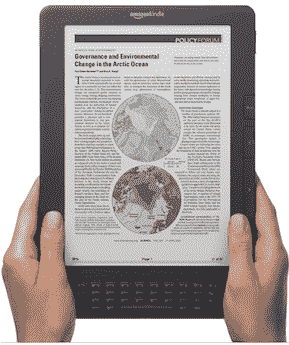

# Kindle 书籍取代平装本书籍成为亚马逊最受欢迎的格式 

> 原文：<https://web.archive.org/web/http://techcrunch.com/2011/01/27/kindle-books-overtake-paperback-books-to-become-amazons-most-popular-format/>

# Kindle 书籍取代平装本书籍成为亚马逊最受欢迎的格式

像素打印临界点是否已经达到？去年七月，我们[报道了](https://web.archive.org/web/20230202234451/https://techcrunch.com/2010/07/19/kindle-sales/)亚马逊的 Kindle 电子书阅读器的销量已经超过了精装书，每 100 本精装书就卖出 143 本 Kindle 书。现在[领先](https://web.archive.org/web/20230202234451/http://phx.corporate-ir.net/phoenix.zhtml?c=176060&p=irol-newsArticle&ID=1521090&highlight&ref=tsm_1_tw_kin_prearn_20110127)也适用于平装书，每 100 本平装书就有 115 本 Kindle 书售出。

精装书本身的统计数字翻了一番，2010 年 Kindle 书籍的销量是平装书的三倍。免费的 Kindle 图书不包括在这个数字中，否则这个数字会高得多。

Kindle 商店现在有超过 810，000 本书，其中超过 670，000 本的价格为 9.99 美元或更低。这个数字包括 107 本《纽约时报》畅销书。

由于对数字业务的积极关注，亚马逊第一个季度实现了 100 亿美元的收入。亚马逊首席执行官杰夫·贝索斯预测这一数字印刷里程碑将在今年第二季度发生，因此它比预期提前了，但无论如何，这是不可避免的。