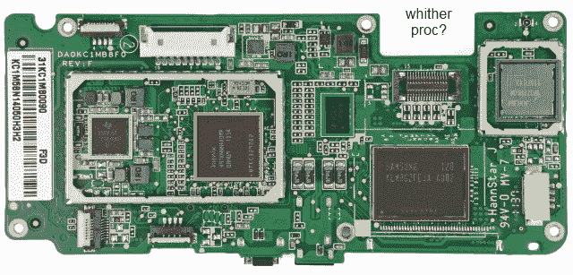

# Kindle Fire 被拆——这并不奇怪 

> 原文：<https://web.archive.org/web/http://techcrunch.com/2011/11/15/kindle-fire-gets-torn-down-no-surprises-here/>

iFixit，保佑他们的心，[已经把 Kindle Fire 撕成碎片](https://web.archive.org/web/20230205005915/http://www.ifixit.com/Teardown/Amazon-Kindle-Fire-Teardown/7099/1)，尽管事实证明，本来就没有那么多碎片。电池是一个巨大的单元，所有的处理和 I/O 都发生在设备底部的一块 PCB 上。

那些期望从外部和内部复制[剧本](https://web.archive.org/web/20230205005915/https://techcrunch.com/tag/playbook/)的人将会失望:布局、电池、PCB 和所有组件都不同，这使得外形或多或少成为两款设备之间唯一真正的相似之处。

也就是说，它们可能共享一个处理器单元；报道称 TI 是供应商，1GHz 听起来没错。奇怪的是，它在 PCB 的表面上是不可见的，或者是以这样一种方式集成的，如果不进行更具侵入性的拆卸就无法识别。但是 TI 提供了收发器、电源管理器等等，所以这是一个安全的赌注。**更新**:是的，藏在 RAM 模块下面，是 TI OMAP 4430，跟 Playbook 用的是一个型号。

他们提到的我之前没有注意到的一点是，电池的充电时间假设它支持 1.8 安培的插座连接；大多数 USB 端口和电缆都不提供这种功能，所以 USB 充电时间会更长(大多数设备可能都是这样)。总充电量为 4400 毫安时，低于 iPad 2 的 6600 毫安时，但当然这有一个明显更小的屏幕和更低的 CPU/GPU 强度。

似乎没有任何隐藏或未宣布的功能——就个人而言，我希望扬声器组件内有一个麦克风，用于亚马逊最新收购的产品。但是看起来这场火就像他们说的那样，不多也不少。

在我写这篇文章的时候，他们刚刚完成拆卸，可能会像以前一样，包括一些来自 Chipworks 的额外信息，所以如果相关数据被发现，我会更新这篇文章。