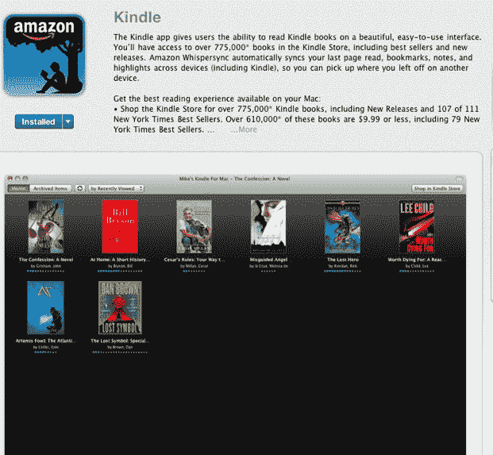

# Kindle 来到 Mac 应用商店，已经是第五大免费应用 TechCrunch

> 原文：<https://web.archive.org/web/https://techcrunch.com/2011/01/10/kindle-mac-app-store/>

# Kindle 来到 Mac 应用商店，已经是第五大免费应用

Kindle 继续其在每一个主要计算平台上的追求，现在在 n [ew Mac 应用商店](https://web.archive.org/web/20230202230129/https://techcrunch.com/2011/01/06/apple%E2%80%99s-mac-app-store-opens-with-more-than-1000-apps/)中作为[应用](https://web.archive.org/web/20230202230129/http://itunes.apple.com/us/app/kindle/id405399194?mt=12)出售。作为 teh Mac 应用商店中的第一款电子书应用，它已经是下载量第五多的免费应用。

亚马逊正在推行 Kindle“一次购买，随处阅读”的策略，即一旦你下载了 Kindle 书籍，你就可以在任何设备上继续阅读。你可以在 Kindle、T4 iPhone T5、iPad T6、安卓 T7、黑莓 T8、Windows PC T9、Windows Phone 7 和 Mac 上阅读 Kindle 书籍。Kindle 已经在去年 3 月推出了 [Kindle for Mac，但这个版本是通过 Mac App Store 发布的，这是 OS X 最新更新的一部分。](https://web.archive.org/web/20230202230129/http://www.crunchgear.com/2010/03/18/kindle-for-mac-now-live-and-free/)

iPhone 和 iPad 上的 Kindle 应用程序也进行了更新，让用户可以访问数百万本免费书籍，更好的图像缩放，以及在你做其他事情时在后台下载书籍的能力。

