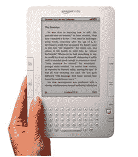
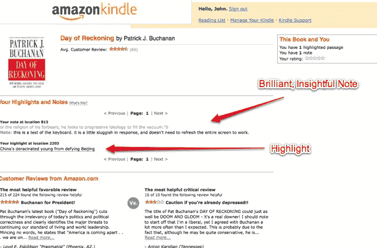

# Kindle 笔记和集锦现可在网上访问 TechCrunch

> 原文：<https://web.archive.org/web/https://techcrunch.com/2009/05/26/kindle-notes-and-highlights-now-accessible-on-the-web/>

# Kindle 笔记和集锦现在可以在网上访问

大约半小时前，亚马逊在 Kindle 上开放了一项新功能:可以在网上阅读你的笔记和精彩内容。读者总是能够在 Kindle 上做笔记和高亮显示文本。现在这些注释出现在你在 http://kindle.amazon.com T2 的账户上。登录后，您可以看到所有笔记。

虽然这开启了各种可能性，但亚马逊采取了非常保守的方法。您不能与他人共享您的笔记。你甚至不能在浏览器中编辑它们。你所能做的就是阅读它们。这使得该功能只不过是你的笔记和突出显示的文本片段的网络存档。这是一个方便的功能，但为什么不启用共享呢？为什么我不能在脸书或 Twitter 上与我的朋友分享摘录(以引用和简短链接开头)？

亚马逊需要将 Kindle 连接到网络的其他部分。希望这是朝着这个方向迈出的第一步。

