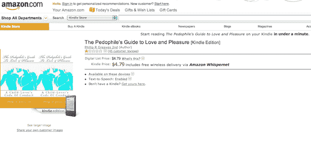

# 第 158，221 本最畅销的 Kindle 书:恋童癖者的爱情和快乐指南 

> 原文：<https://web.archive.org/web/http://techcrunch.com/2010/11/10/kindle-pedophile-book/>

# 第 158，221 本最畅销的 Kindle 书:恋童癖者的爱和快乐指南

亚马逊喜欢吹嘘他们的 Kindle 书店的一点是他们收集了大量的书籍。我会说。这里有一个很好的例子，我敢肯定你在竞争对手的电子书店里找不到的:[恋童癖者的爱和快乐指南](https://web.archive.org/web/20230216141426/http://www.amazon.com/Pedophiles-Guide-Love-Pleasure-ebook/dp/B0049U4CF6/ref=cm_cr_pr_product_top)。是的，这是真正的标题。

这本书不会真的是关于那个的吧？嗯，下面是描述:

> 这是我的尝试，通过建立一些成年人可以遵循的规则，让那些发现自己卷入恋童癖的青少年更加安全。我希望通过唤起恋童癖者更好的本性来实现这一点，希望他们这样做会减少仇恨，如果他们被抓住，也许会得到更多的判决。

抛开“升”不谈，是的，这是令人发指的。

亚马逊的顾客正在让人们知道他们对这样一本书的感受。在 59 个顾客对该产品的评价中，58 个给了它最低 1 星(而一个小丑给了它 5 星)。看起来几乎所有的都是今天的，他们基本上都在呼吁抵制亚马逊出版这样的书，或者要求亚马逊立即下架。他们中的一些人说，他们已经给亚马逊打了电话或发了电子邮件，该公司表示正在调查此事。

但一位评论者表示，亚马逊已经用以下内容回复了他们:

> “我向你保证，Amazon.com 不支持或宣扬仇恨或犯罪行为；我们支持每个人做出自己购买决定的权利。”
> 
> “亚马逊网站认为不出售某些图书是审查制度，因为我们认为它们的信息是令人反感的。”

另一条评论说，到目前为止，已经有超过 100 条负面评论被删除，但它们仍在不断出现。这可能会变得很难看。

我们已经联系了亚马逊请其置评，但尚未收到回复。如果有，我们会更新。

这本书只有 Kindle 版本，售价 4.79 美元。它是目前商店中最畅销的 158，221 本 Kindle 图书。太可怕了。

**更新**:亚马逊声明如下:

> 亚马逊认为，仅仅因为我们或其他人认为某些书的信息令人反感，就不出售这些书，这是审查制度。亚马逊不支持或促进仇恨或犯罪行为，但是，我们支持每个人做出自己购买决定的权利。

