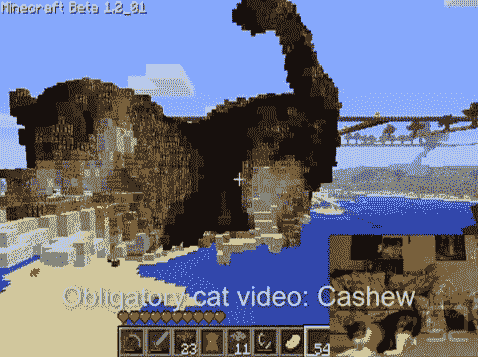

# Kinect +《我的世界》=全动态 3D 雕像 

> 原文：<https://web.archive.org/web/https://techcrunch.com/2011/01/24/kinect-minecraft-full-motion-3d-statues/>

# Kinect +《我的世界》=全动态 3D 雕像

[http://c.brightcove.com/services/viewer/federated_f9?isVid=1 & isUI=1](https://web.archive.org/web/20221207114517/http://c.brightcove.com/services/viewer/federated_f9?isVid=1&isUI=1) 我现在发布这个更新，因为它太疯狂了，不能错过。

这个项目的细节，基本上是从 Kinect 导入静态数据，然后在《我的世界》用积木重新组装，[可以在这里找到](https://web.archive.org/web/20221207114517/http://www.orderofevents.com/MineCraft/KinectInfo.htm)。这些电影是通过保存、渲染，然后将多个帧粘贴在一起而合成的。“第三阶段”正在进行中，可能会使这一过程自动化。

[通过 [1up](https://web.archive.org/web/20221207114517/http://gamevideos.1up.com/video/id/32691)