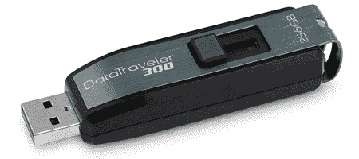

# 金士顿推出首款 256GB 闪存驱动器

> 原文：<https://web.archive.org/web/https://techcrunch.com/2009/07/20/kingston-outs-the-first-256gb-flash-drive/>

# 金士顿推出首款 256GB 闪存驱动器

 
先关了，你买不起这个优盘。但即使可以，也不应该买。我的意思是，今天，它将花费你 900 美元，但我们都知道明年将是 90 美元，如果不是更少的话。所以好好看看[金士顿 DataTraveler 300](https://web.archive.org/web/20230330140418/http://www.kingston.com/ukroot/flash/dt300.asp) ，进入固态硬盘和闪存驱动器的未来之梦。