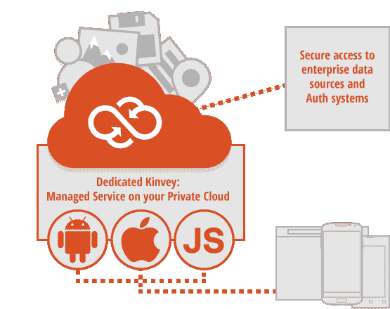

# Kinvey 为企业开发人员推出专用后端即服务平台 TechCrunch

> 原文：<https://web.archive.org/web/https://techcrunch.com/2014/02/13/kinvey-launches-dedicated-backend-as-a-service-platform-for-enterprise-developers/>

以企业为中心的移动应用后端即服务(BaaS)平台 Kinvey 今天推出了一项新功能，允许其客户在专用私有云或内部运行他们的应用，而不是在 Kinvey 的常规多租户平台上运行。

虽然像 Parse 或 StackMob(被 PayPal 收购后即将关闭)这样的 BaaS 平台消除了管理和扩展支持现代应用程序的服务器堆栈的许多麻烦，但企业仍然经常不愿意将自己的专有数据托管在别人的服务器上。

在许多行业中，这些公司还必须遵守政府法规(HIPAA/PCI ),这实际上阻止了他们将数据放入公共云服务。金维首席执行官斯拉维什·斯里达尔告诉我，这些正是这项服务所追求的行业(制药、保险、金融服务等)。)及其内部解决方案。该公司还计划在不久的将来获得自己的 HIPAA 和 PCI 认证。

一旦一家公司为 Kinvey 安装提供了本地服务器，该服务就将它们绑定到其发布系统中，从此由 Kinvey 管理。作为专用解决方案的一部分，企业可以选择向其开发人员提供哪些附加组件，并为其员工定制开发人员门户。

金维表示，通过这项新的专用服务，企业 IT 将能够为公司的开发人员提供对企业数据、认证服务和移动后端功能的访问，而没有数据泄露的风险。这意味着企业可以为其员工、合作伙伴和客户推出应用，同时保持对数据的控制。专用平台有防火墙保护，所有数据和网络通信都经过加密。

该公司目前为 Android 和 iOS 上的原生移动应用以及 HTML5 应用提供官方支持。此外，[团队积极支持使用 AngularJS、Backbone.js、PhoneGap、Node.js 和 Appcelerator 的 Titanium 等工具的](https://web.archive.org/web/20230129084831/http://devcenter.kinvey.com/backbone/guides)开发者。需要黑莓和 Windows 等其他平台支持的客户可以使用一组开源库。

随着 StackMob 在 5 月份关闭，Parse 被脸书收购，Kinvey 仍然是剩下的少数几个独立的 BaaS 平台之一。他认为这是由于公司对企业的关注。他认为，很难通过“仅仅”为个人开发者解决后端问题来创造一个可持续的长期业务，尤其是对于只筹集了 A 轮融资的公司。

因为其他平台往往将定价与应用的成功挂钩，所以他们最终非常依赖于在其网站上快速增长的初创公司，但大多数用户仍然停留在免费或低端层次。为了独立扩展，他认为这些平台需要追逐企业市场。

总部设在波斯顿的金威公司目前有 21 名员工，并且正在加快在 T4 的招聘步伐。该公司迄今已融资约 700 万美元，包括 2012 年 500 万美元的 A 轮融资。