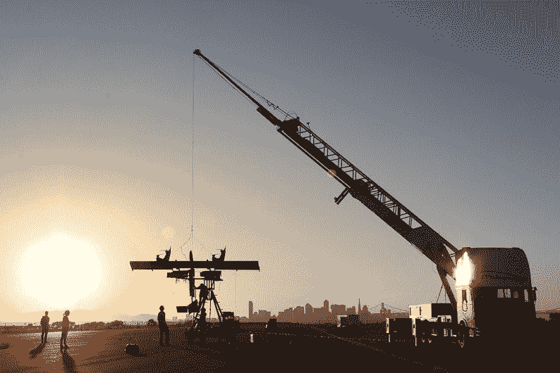
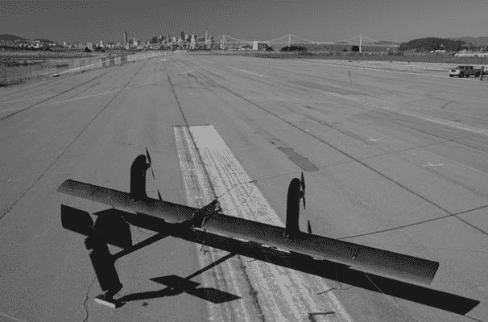

# 风筝般的涡轮机在高空利用风力 

> 原文：<https://web.archive.org/web/https://techcrunch.com/2012/01/16/kite-like-turbines-harness-wind-power-at-altitude/>

# 风筝般的涡轮机在高空利用风力

放风筝发电可能会让人想起本·富兰克林，他试图证明闪电是电的。Makani Power 向空中释放一个涡轮叶片，试图在更高的高度利用风能。

类似迷你飞机的 Makani 机载风力涡轮机 T1 在风速达到每秒 3.5 米时启动。每个叶片上的转子有助于推动它进入轨道，一旦升空就可以兼作涡轮机。这些叶片用一根绳子拴在地面上，这根绳子输送能量，将它们抛向天空，并接收涡轮机产生的能量，将这些能量发送到与电网相连的地面站。

一旦进入空中，机翼就会沿着垂直于风向的圆形飞行路线飞行。打击转子的侧风可以达到实际风速的 10 倍以上，叶片可以调整位置来满足它。高空的风速通常是近地面风速的两倍，这使得机载叶片可能比地面涡轮机更强大。它们的重量轻也使它们比传统涡轮机生产成本更低，而且维护工作可以在地面上进行。

当风速低于每小时 9 英里时，叶片转换到悬停模式，并卷回地面站停靠。

该公司从[能源部的 ARPA-E 计划](https://web.archive.org/web/20221207191311/http://arpa-e.energy.gov/ProgramsProjects/OtherProjects/RenewablePower/AirborneWindTurbine.aspx)获得了 300 万美元，还从谷歌获得了 2000 万美元的资金。

虽然这些涡轮机有潜力，但它们仍在接受测试。Makani 计划建造更大的机翼，可以达到 1600 英尺的高度，为 600 个家庭供电。该公司目前最大原型的时间表是 2013 年，希望两年后开始商业生产。

点击此处观看其中一次试飞:

【YouTube http://www.youtube.com/watch?v=sKcp3h0VlK0&w=640&h=360]

*照片由[马卡尼力量](www.makanipower.com)*