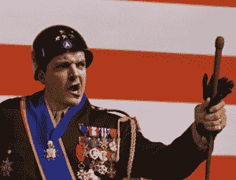

# Kixeye 聘用前 Zynga 高管和 Lionside 联合创始人布兰登巴伯 TechCrunch

> 原文：<https://web.archive.org/web/https://techcrunch.com/2011/12/13/kixeye-hires-ex-zynga-exec-and-lionside-co-founder-brandon-barber/>

# Kixeye 雇佣了前 Zynga 高管和 Lionside 联合创始人布兰登·巴伯

回到 8 月份，社交游戏开发商 Kixeye 在 C 轮融资中筹集了 1800 万美元，并将 Zynga Andrew Trader 加入其董事会。今天，这个自称“最大的在线战略格斗游戏制造商”宣布又一位前 Zynga 高管加入进来。

[Brandon Barber](https://web.archive.org/web/20221006204843/http://www.linkedin.com/in/brandonb) 将加入 Kixeye，担任营销 SVP，他将直接向董事长兼首席执行官 Will Harbin 汇报。巴伯为 Kixeye 带来了丰富的游戏经验，因为他之前曾联合创立了在线体育游戏开发商 [Lionside](https://web.archive.org/web/20221006204843/http://www.crunchbase.com/company/lionside) ，该公司于今年 6 月被 ngmoco 收购。在巴伯(他也是营销和制作副总裁)身后，Lionside 将体育游戏带到了脸书，并创造了 NBA Legend 和 Lionside Football 等游戏。

 在创立 Lionside 之前，Barber 是 Zynga 的第一任营销副总裁，负责制定公司最初的沟通、品牌和产品营销战略。Zynga 专门为他创造了这个角色，考虑到他直接向安德鲁·交易员报告，这位前 Zynga 二人组似乎又联系在一起了。

在 Zynga 之前，Barber 担任 EA 的全球营销总监，他“负责 EA 基于 web 服务的商业模式的概念、设计、部署和盈利能力”，以及其他工作。

Kixeye 这一年过得很好，招到了一些关键员工，也变得盈利和现金流为正。期待 2012 年更多大动作。