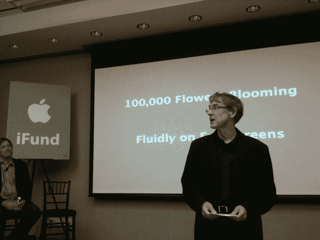
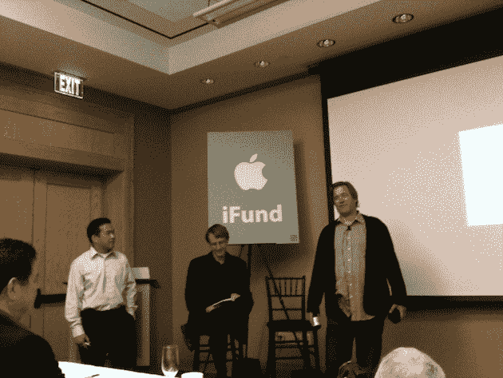
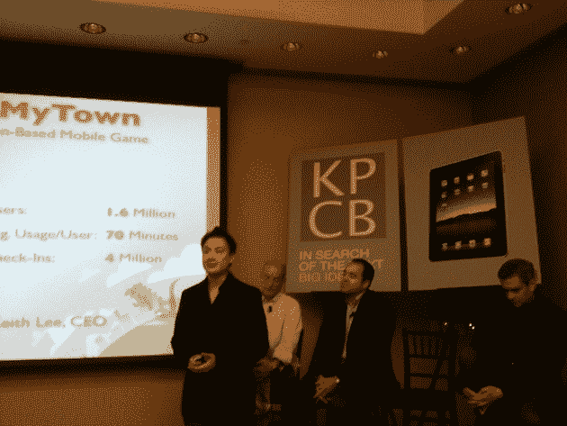

# 凯鹏华盈(Kleiner Perkins)将 iPad | TechCrunch 的投资基金翻倍至 2 亿美元

> 原文：<https://web.archive.org/web/https://techcrunch.com/2010/03/31/kleiner-perkins-ipad-fund/>

今天，在加州门洛帕克的玫瑰镇沙丘酒店，[凯鹏华盈&拜尔斯](https://web.archive.org/web/20230325192635/http://www.kpcb.com/)举办了一场围绕“移动内容革命”的活动这家著名的风险投资公司对这次活动的实际内容守口如瓶，但导致这次活动的猜测是，它可能涉及苹果的新 [iPad](https://web.archive.org/web/20230325192635/http://www.crunchbase.com/product/ipad) ，该产品将于周六在美国发布。果然是。

凯鹏华盈(Kleiner Perkins)今天宣布将其 iFund 增加一倍(或者按照合伙人约翰·杜尔登的说法是“加倍”)至 2 亿美元。最初，这包括投资组合公司在 5 月份提交的十几个 iPad 应用程序。2008 年 3 月，当苹果发布其 [iPhone SDK](https://web.archive.org/web/20230325192635/https://techcrunch.com/2008/03/06/live-blogging-of-apple-iphone-sdk-event-begins-soon/) 时，凯鹏华盈发布了第一个 [iFund，一个 1 亿美元的基金](https://web.archive.org/web/20230325192635/https://techcrunch.com/2008/03/06/kleiner-perkins-anounces-100-millioin-ifund-for-iphone-applications/)来刺激 iPhone 应用开发。

与会的 iFund 投资组合公司包括 Booyah、Cooliris、GOGII、InMobi、ngmoco、Pinger、Shazam、shopkick 和 Zynga。iFund 现在总共有 14 家风险企业，其中 3 家处于秘密模式。多尔指出:“他们表现出色。

Doerr 指出，事实上，iFund 公司开发的应用程序总下载量已经达到 1 亿次。预计这些公司今年将获得约 1 亿美元的收入。合伙人马特·墨菲指出，其中四家公司已经盈利。问题是，随着成功，iFund 没有钱了——凯鹏华盈实际上筹集了额外的 3.3 亿美元，在 iFund 的初始投资之外注入这些公司。有一种新设备问世了…

杜尔说:“在 iPad 上市前夕，iFund 没钱了。因此，基金翻了一番。

在 iFund 的资助下，目前有超过 20 种 iPad 应用程序正在开发中。其中 11 款将于周六与 iPad 一同发布。多尔似乎对 5 周内将推出的一款隐形产品(他不愿具体谈论)特别兴奋，这款产品将仅适用于 iPad。

*下面，找我的现场笔记(转述):*

**约翰·杜尔登**:15 年前，也就是 1994 年，还没有互联网。没有浏览器。史蒂夫·乔布斯离开了苹果，他正在制作《玩具总动员》和 NeXT。那一年我看到了第一个网络浏览器 Mosiac。太神奇了。90 年代剩下的日子是一段美好的经历。所有这些公司都来了。硅谷是 20 世纪 80 年代的佛罗伦萨

“感觉似曾相识。一辈子两次。”

一款 tsumani 手机风靡全球——现在已有 30 亿人拥有。包括非洲偏远地区的人们。肯尼亚的手机数量是个人电脑的 75 倍。4 年后，那里将会有 3200 万部手机。每个人的口袋里都会有互联网和手机。

几年前，史蒂夫·乔布斯用 iPhone 震撼了世界。“如果你不能发明未来，那么退而求其次的办法就是为未来提供资金。”

回想 2008 年 3 月 6 日，iFund 有点冒险。没有 iPhone 3G **。我们现在在 iFund 有 14 个项目，3 个是秘密的。他们中的 8 个人今天在这里。他们太棒了。**

有 1 亿次下载，今年来自这些公司的收入将超过 1 亿美元。我们已经为他们筹集了 3.3 亿美元。但是在 iPad 上市前夕，iFund 没钱了。引用比尔·坎贝尔的话，“你得有钱。”所以我们把基金翻倍到 2 亿美元。

本周六 iPad 上市，我们相信它将统治世界。我抱过它，抚摸过它。感觉你在触摸未来([杜尔从我这里偷走了](https://web.archive.org/web/20230325192635/https://techcrunch.com/2010/01/27/ipad/))。

我们将进入一个勇敢的新世界。从 Windows 界面的旧世界到触摸。流动性的波动。iPad 很直接，很自然。**WYTIWis——你触摸的东西就是**。

**苹果开发人员关系副总裁 Ron Okamoto:**

两年前，约翰处境危险。现在它是一棵树。有了 iPad，这将是一件大事。我们有 100，000 名开发人员，开发了超过 150，000 个应用程序，这些应用程序已经被下载了 30 亿次。这仅仅发生在 24 个月内。有了 iPad，这个数字会更大。

你必须有一个很酷的名字才能得到凯鹏华盈的资助(笑)。我们已经看到了开发人员目前正在做的工作，这太棒了。过几天，你也会看到的。

**多尔重返舞台**

十万朵鲜花盛开。平板电脑是实现所有这些梦想的地方。这将开启软件的第三次复兴。这将是一个新的互联、互动的世界。这种未来将改变所有领域(医疗保健等)。在接下来的十年里，3 倍更好的电池和 10 倍更好的芯片。你很快就会拥有 1tb 的本地快速存储。

我一直对企业家心存敬畏。让我们和在基金会工作的人谈谈。

**宾·戈登，凯鹏华盈**

我没有准备好的讲稿。那是 iPad 问世的前一天晚上，除了全家人试图扔掉他们的鼠标，没有任何动静。我要做一个预测。许多世纪以前，书写肢体语言。50 年前，打字机的肢体语言。然后是 iPhone 肢体语言。现在 iPad 的肢体语言。

**格雷格·伍克，首席执行官平格尔**

我在很多公司工作过，没有哪家公司像 iPhone 一样成功。我们有付费应用和免费应用。许多不同的商业模式——应用添加、应用购买。我们已经制作了 13 部作品，其中 10 部进入了前 100 名。很大程度上是因为我们用自己的应用来销售其他应用。如果你不在前 100 个应用中，你很难被看到。我们盈利了——在一年内，实际上是在 9 个月内！

所以 iPad:我能看到的最强烈的事情是，我的女儿立刻知道她想要一个。我们在为 iPad 制作涂鸦伙伴。用你的手(而不是用你的手指(用 iPhone))可以得到的最大乐趣。

**基思·李，布耶**

当我们看到 iPhone 时，我们知道我们必须离开在暴雪的工作。相机，全球定位系统，这对于新体验来说意义重大。4 个月前，我们推出了 MyTown。这是最受欢迎的基于位置的社交游戏。这是真正的垄断。我们已经达到了 160 万注册用户。一周 13 万新用户。我们一直都在排行榜的前 50 名。人们在我们的游戏中每天花费 7000 万英镑(每个用户)。**我们每天有 400 万人次入住**。

亚历克斯·穆西尔，沙扎姆

我们遍布 200 多个国家，拥有 5000 万用户，每周新增 75 万用户。每天有 200 万个标签。**iPhone 上的下载量超过 1500 万次**。自从我们在 App Store 上线以来，排名一直是前 50 名。**我们也会使用 iPad**。这不仅仅是一个大的 iPhone 应用程序，而是一种新的体验。你会在星期六看到它。

**尼尔·杨，ngmoco**

我们相信 iPhone 可以彻底改变手机游戏，iFund 很早就支持了我们。我们的软件下载量已经超过 30，000，000 次。我们有 15 个排名前 10 的应用程序。我们现在的统治是巨大的。我们运营 plus 网络，这些游戏的下载量超过 2000 万次。**每天用户玩 ngmoco 游戏的时间超过 2000 万分钟。**

iPad 将彻底改变家庭游戏。iPad 彻底改变了你与软件互动的方式。在 iPad 发布时，我们将有 7 个应用程序可用。都是专为 iPad 打造的。是的，我们的统治即将降临 iPad。

**扎克·诺曼，戈吉尔**

textPlus 是下一代信息平台。它破坏了电话和短信之间的关系。每天 1500 万条信息。自我们发布以来已有 20 亿条信息。我们的用户平均每天使用 65 分钟。550 万用户。

但是 iPad 将会改变一切——因为它不是一部手机。这更像是 iPod touch。用例还有待编写和想象。文字是一代人的声音——其他代人也在跟着他们走。我认为这款新设备对于短信来说将是巨大的(同样，没有电话部分)。

**宾戈登回来了**

Zynga 和 Cooliris 和 Shopkick 也在这里回答问题。我们一会儿就开始问答。戈登在读一首关于 iPhone 的诗(是的，真的)。

**问&一个时间**

**问**:国际基金中有多少家公司是盈利的？iPad 的机会比 iPhone 大吗？

答(来自海外的马特·墨菲):目前有 4 家公司盈利，我们不会透露是哪几家。现金流肯定有利可图。

对于是否会提高 iPad 应用程序的价格，专家小组意见不一。有些会保持免费，有些不会涨价。

答(尼尔·杨):iPad 还处于早期阶段，市场上有 7500 万台 iPhone(和 iPod touch)设备。iPad 会比我们认为的 iPhone 吸引更多的用户。我认为客厅游戏将会面临来自 iPad 的竞争。桌面游戏也是如此。

答(宾·戈登):我认为 iPad 的市场会比 iPhone 上的应用更大。

问:iPad 会比 iPhone 大吗？

约翰·杜尔登):我不知道。我不知道将要建立什么样的应用程序，但让我告诉你一些我想到的。我认为每个医生和护士都会使用 iPa。我不认为我们可以预见这些伟大的新用途。

**问**:总体而言，平板电脑是否有更大的商机？

答(宾·戈登):来自 iFund 的资金也可以用于其他平台的开发。

**问**:iPhone 或 iPad 的收入占比是多少？

答(来自小组):将会是大部分。iTunes 方面是关键，它是一个很好的基础设施。就我们能发展到多大而言，我们大多数人仍是沧海一粟。目前，苹果在这一领域拥有不可思议的领先优势。称 iPad 为平板电脑有点像称 iPhone 为手机——意义远不止如此。

**问**:两年后，iPhone 的使用率是多少？

库里斯:我们在 iPhone 上只有一个应用程序

答(Shopkick):和 CauseWorld 一样，多数是 iPhone。

答:很大，而且还在增长。

**问**:在 iPad 上开发最大的惊喜是什么？

答(来自小组):SDK 的第一次迭代真的很完整，这很棒。iPad 不是一个大的 iPod touch——这没有抓住要点。当你玩它的时候，你会忘记你在用什么东西。**你不再考虑你正在做的互动，你只是做**。你必须触摸它才能明白。移动软件是围绕，当你有一秒钟，你就使用它。但是 iPad 更多的是一种向后倾斜的体验。这显然不是一个更大的 iPod touch。这个装置很神奇。它将改变普通人对计算的感觉。

问:那么，离第一个非 iPhone 杀手级应用出现还有多久？

答:《局内人 6 个月》我想你会看到第一部。如果你想为 Xbox 360 开发一个杀手级应用程序，你可能要花两年时间。对于 iPhone 和 iPad 来说，这一切发生得如此之快。

答(来自 Doerr): **在 5 周内，一家秘密投资公司将推出一款 iPad 专用应用**。很快，我们将会看到改变事物的教育应用。

**问**:苹果的封闭平台和安卓的开放平台相比怎么样？

答:有两种不同的哲学。iPhone 最先到达那里，但是每一个都会让另一个变得更好。我不知道哪个会赢。

**问**:医疗保健行业有什么秘密吗？

答:无可奉告。

问::医疗保健方面会有很多新想法吗？

a:我迫不及待地想看看我们会得到什么。

戈登:谢谢你过来。那就结束了。