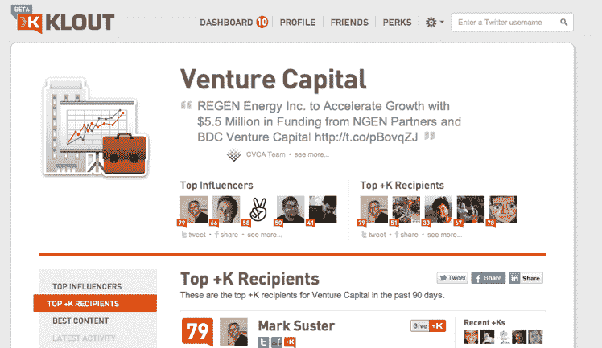

# Klout 增加了主题页面，为用户提供了关于某个主题及其影响者的更多背景信息 

> 原文：<https://web.archive.org/web/http://techcrunch.com/2011/09/15/klout-adds-topic-pages-to-give-users-more-context-around-a-subject-and-its-influencers/>

# Klout 添加了主题页面，为用户提供了关于主题及其影响者的更多上下文

[Klout](https://web.archive.org/web/20230203091322/http://klout.com/) ，一家由[衡量在 Twitter、【脸书】、](https://web.archive.org/web/20230203091322/https://techcrunch.com/2009/11/17/klout-influence-twitter-list-authority/) [LinkedIn](https://web.archive.org/web/20230203091322/https://techcrunch.com/2011/06/14/klout-expands-influence-scoring-to-professional-social-network-linkedin/) 、YouTube、 [Foursquare](https://web.archive.org/web/20230203091322/https://techcrunch.com/2011/08/04/klout-adds-foursquare-but-how-much-will-it-boost-my-score/) 、 [Instagram、Flickr、Tumblr](https://web.archive.org/web/20230203091322/https://techcrunch.com/2011/08/10/after-foursquare-klout-adds-blogger-tumblr-instagram-flickr-and-last-fm-to-measure-social-influence/) 和其他网站上影响力的初创公司，如今正在扩大其产品阵容，推出[主题页面](https://web.archive.org/web/20230203091322/http://corp.klout.com/blog/2011/09/klout-topic-pages/)。

刚刚达到 1 亿 Klout 分数的 Klout 旨在提供关于特定主题的更多背景信息。在主题页面上，Klout 显示给定主题中的顶级影响者，而不考虑他们的 Klout 总分。页面展示了最近影响他人的内容，以及 top +K 的接收者(+K 是一个[衡量工具](https://web.archive.org/web/20230203091322/http://corp.klout.com/blog/2011/06/influence-is-topical/) Klout 让用户投票决定同行在主题中的影响力)。Klout 将此比作“人民选择奖”。Klout 表示，它计划向主题页面添加分析、趋势等内容。

例如，我的风险投资[主题页面](https://web.archive.org/web/20230203091322/http://klout.com/#/topic/venture-capital/influencers_plusk)将马克·苏斯特、乔希·科佩尔曼和大卫·霍尼克列为顶级影响者。Top +K 获得者包括弗雷德·威尔逊。围绕每一条分享的内容，你可以看到是谁影响和分享了这些内容。

可以通过点击网站上的任何主题链接来访问主题页面，例如从某人的主题页面。某个主题的顶级影响者是根据其他主题影响者对内容的互动和参与来确定的。正如创始人 Joe Fernandez 告诉我的，这有助于将 Klout 变成一个发现平台，而不仅仅是检查你自己(或他人)的分数。

Klout 说，目前，主题页面对上个月选择了主题页面预览特权的用户开放。这家初创公司计划在未来几周让更多人进入主题页面预览。

作为背景，Klout 通过复杂的排名算法和内容的语义分析来评估用户的行为，以衡量个人对社交网络的影响。在 Twitter 上，Klout 的影响力得分是基于用户通过推文、转发等推动行动的能力。在脸书，Klout 将研究对话和内容如何通过点赞、评论等方式从该网络的数亿用户中激发兴趣和参与度。

