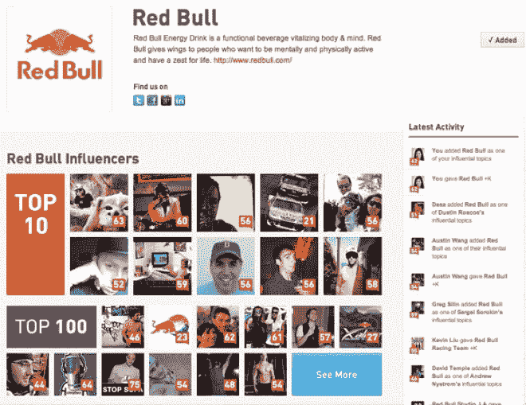

# Klout 推出品牌页面，帮助公司吸引有影响力的人 TechCrunch

> 原文：<https://web.archive.org/web/https://techcrunch.com/2012/04/17/klout-launches-brand-pages-to-help-companies-engage-influencers/>

# Klout 推出品牌页面，帮助公司吸引有影响力的人

[Klout](https://web.archive.org/web/20221206184611/http://klout.com/),[衡量在 Twitter、【脸书】、](https://web.archive.org/web/20221206184611/https://beta.techcrunch.com/2009/11/17/klout-influence-twitter-list-authority/) [LinkedIn](https://web.archive.org/web/20221206184611/https://beta.techcrunch.com/2011/06/14/klout-expands-influence-scoring-to-professional-social-network-linkedin/) 、YouTube、 [Foursquare](https://web.archive.org/web/20221206184611/https://beta.techcrunch.com/2011/08/04/klout-adds-foursquare-but-how-much-will-it-boost-my-score/) 、 [Google+](https://web.archive.org/web/20221206184611/https://beta.techcrunch.com/2011/09/20/klout-now-measures-social-influence-on-google/) 和其他社交应用上的影响力的初创公司[推出了](https://web.archive.org/web/20221206184611/http://corp.klout.com/blog/2012/04/a-new-twist-on-influence-%E2%80%93-brand-squads/)一项名为 Brand Squads 的新功能，由专门的个人资料页面组成，为公司提供了一个与有影响力的人进行互动的集中场所。

作为背景，Klout 通过复杂的排名算法和内容的语义分析来评估用户的行为，以衡量个人对社交网络的影响。该公司目前的 API 调用次数超过了 120 亿次，高于 2011 年 1 月的 1 亿次。该公司拥有超过 5000 个 API 合作伙伴，而 2010 年初只有 100 个左右。它已经索引了超过 1 亿个公共档案。Klout 还刚刚从凯鹏华盈(Kleiner Perkins)和其他人那里筹集了大约 3000 万美元的资金，合伙人 Chi-Hua Chien 加入了这家初创公司的董事会。

正如 Klout 的大卫·坦普尔解释的那样，品牌团队“是 Klout 给有影响力的人一个被认可的地方，并对他们最关心的品牌产生直接影响的方式。”以前，品牌有更简单的页面，只有 Klout 分数。品牌团队是品牌页面上的一个不同的转折，品牌的顶级影响者有机会被认可并对品牌产生影响。

通过这些品牌专用页面，Klout 用户可以看到每个品牌的顶级影响者的动态列表，观看社交媒体上的对话，监控关于品牌最近发展的信息，并获得特殊津贴。额外津贴是作为 Klout 分数的结果而给予的独家优惠或体验。

Klout 正在推出以红牛为合作伙伴的品牌团队。因此，如果你看一看红牛[“品牌团队”，](https://web.archive.org/web/20221206184611/http://klout.com/#/topic/red-bull)你会看到红牛已经提供了额外津贴，将在未来几周内推出给他们的顶级影响者。最有影响力的人将会得到一些商品或一次极限运动之旅。

【T2