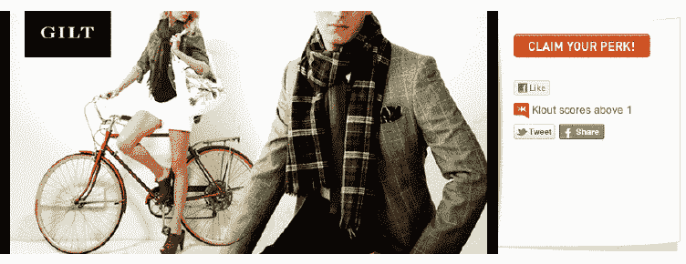

# Klout 开始推出与你的分数相符的额外津贴，与 Gilt 合作享受折扣 

> 原文：<https://web.archive.org/web/http://techcrunch.com/2012/03/05/klout-starts-rolling-out-perks-that-match-your-score-partners-with-gilt-for-discounts/>

# Klout 开始推出与你的分数匹配的额外津贴，与 Gilt 合作享受折扣

衡量在 Twitter、LinkedIn、Google+、脸书和其他社交媒体网站上的影响力的初创公司 Klout 正在扩展其 Perks 计划的功能。Klout Perks 是根据您的 Klout 分数提供的独家优惠或体验。Klout 第一次根据特定的分数来匹配节省。

这家初创公司与 flash 销售网站 Gilt 合作，允许 Klout 成员利用他们的影响力，从他们购买的 Gilt 中获得与 Klout 分数匹配的百分比。例如，如果你的 Klout 分数是 81-100，你可以获得高达 100%的折扣。

Klout 和 Gilt 还选择了几个类别的影响者，包括时尚、室内设计、社交媒体、金融和育儿，并请他们策划一场特别销售，在 Gilt 的五个物业中进行展示，包括男性、女性、婴儿和儿童、品味和家居。策展人包括 Gilt Women's business 的 Loren Ridinger、Gilt MAN 的 Art Jonak、Gilt Baby and Kids 的 Ciaran Blumenfeld、Gilt HOME 的 Erin Loechner 和 Gilt Taste 的 Pim Techmuanvivit。

看到 Klout 开始把分数和相应的折扣匹配起来，很有意思。在过去，Klout 提供了 [Spotify 邀请、](https://web.archive.org/web/20230209124840/https://techcrunch.com/2011/07/14/dont-have-a-free-spotify-invite-use-your-klout-perks/)维珍美国航空的免费机票、惠普的笔记本电脑和周末驾驶奥迪 A8。对于 Klout 来说，这是一种通过平台吸引品牌和连接用户的方式。

