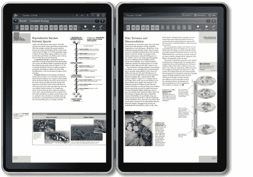

# Kno 平板电脑单屏起价 599 美元，双屏起价 899 美元 

> 原文：<https://web.archive.org/web/https://techcrunch.com/2010/11/08/kno-tablet-599-899/>

# Kno 平板电脑单屏售价 599 美元，双屏售价 899 美元

9 月份，当教科书式平板电脑初创公司 [Kno](https://web.archive.org/web/20221218081417/http://kno.com/) 从安德森·霍洛维茨和硅谷银行融资[4600 万美元](https://web.archive.org/web/20221218081417/https://techcrunch.com/2010/09/08/kno-raises-46-million-more-to-build-most-powerful-tablet-anyone-has-ever-made/)时，它正力争将其双屏平板电脑定价在 1000 美元以下。周二，它将宣布双屏版平板电脑的定价为 899 美元，单屏版为 599 美元。它还将在年底前开始接受有限的预购订单。

这款单屏平板电脑售价 599 美元，比只有 WiFi 功能的 iPad 贵 100 美元，与 T-Mobile 的三星 Galaxy Tab 没有合约的价格相同。但是知识是巨大的。即使是 14.1 英寸屏幕的单面板电脑，也几乎是 iPad 的两倍。那台[在旧金山的 TechCrunch Disrupt](https://web.archive.org/web/20221218081417/https://techcrunch.com/2010/09/27/kno-to-build-a-single-screen-education-focused-tablet/) 上首次亮相(见下面的演示视频)。

虽然 Kno 有一个彩色触摸屏，运行浏览器和学习应用程序，但它与 iPad 的竞争不如与超大尺寸的 Kindle DX 的竞争，后者售价 379 美元，有 9.7 英寸的黑白屏幕，也瞄准了教科书市场。

不过，归根结底，与其说是设备的价格，不如说是每台设备上教科书的可用性和价格。Kno 首席执行官 Osman Rashid 宣称，Kindle Dx 上可用的教科书标题数量不会超过我们的。到那时，Kno 到了学生手中，将会有成千上万的教科书以比印刷版本便宜 30%到 50%的价格出售。Kno 应该在三个学期内收回成本，学生们也不必背着装满纸质教科书的背包到处跑。他们也可以在 Kno 上做笔记。

钱在课本和应用上，而不是在硬件上。“我们不把自己看作一个硬件平台，而是一个学习平台公司，”拉希德说。不难想象，在一两年内，599 美元只需一半的费用，就能为更多的学生打开数字教科书的世界。以下是 Disrupt Kno 的演示视频: