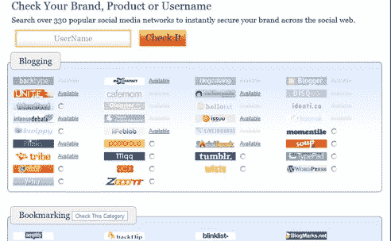

# KnowEm 帮助企业在社交媒体平台上树立品牌主张

> 原文：<https://web.archive.org/web/https://techcrunch.com/2009/10/20/knowem-helps-businesses-stake-their-claim-to-brands-on-social-media-platforms/>

# KnowEm 帮助企业在社交媒体平台上主张自己的品牌

社交媒体领域有越来越多的平台，企业需要在这些平台上“表明自己的主张”，并与消费者互动。但是对于品牌来说，跟踪他们的脸书页面，在 Digg 上的提及，在 Flickr 上的照片，在 Twitter 上的推文等等是很困难的。初创公司 [KnowEm](https://web.archive.org/web/20230324130318/http://knowem.com/) 正在推出一系列服务，旨在帮助大公司和小企业在社交媒体领域树立品牌主张，并管理它们在这些网站上的存在。

在 KnowEm 的网站上，品牌所有者可以立即在 330 多个社交媒体网络上查看他们品牌用户名和关键词的可用性(免费)。KnowEm 返回该品牌已注册和未注册的社交网络列表。然后，品牌可以选择让 KnowEm 在网络上保护公司和产品品牌，并为每个公司或品牌建立档案。公司将在 KnowEm 上有一个仪表板，他们可以从一个集中的平台访问他们在社交媒体网站上的所有资料。仪表盘还包括一个品牌在社交平台(包括 Digg、Twitter 等)上的提及聚合提要。

KnowEm 为品牌提供几种类型的服务。只需支付 349 美元的固定费用，KnowEm 就可以在排名前 150 位的社交媒体网站上创建相关信息，并将其插入个人资料中。售价 99 美元，KnowEm 将为品牌创建简介，但不会填写简介。品牌也可以每月支付 49 美元来保护新兴社交媒体网站上的品牌或用户名。因此，如果有任何社交媒体网站推出，KnowEm 将自动标出该品牌的领地。

这家初创公司自 4 月份以来一直在提供测试版服务，并一直在与一系列有趣的客户合作(这些客户的名字不能透露)，包括三大搜索引擎之一(雅虎、必应或谷歌)、一家大型制药公司和连锁餐厅。

KnowEm 的服务似乎满足了企业、品牌甚至名人在社交媒体领域的真正需求。正如我们从推特[上看到的那样，](https://web.archive.org/web/20230324130318/https://techcrunch.com/2009/05/01/tweexchange-is-the-ultimate-twitter-name-marketplace/)域名抢注对品牌和名人来说可能是个问题。定价似乎相当合理，随着社交媒体平台上品牌参与的重要性上升，KnowEm 可以找到一批忠实的追随者。