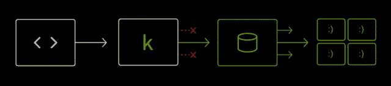
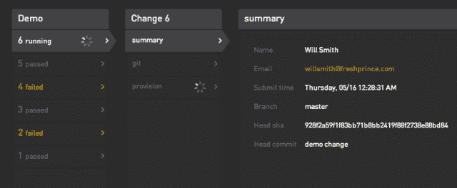

# Koality 通过消除不完整的构建并使测试套件高效来帮助工程师 TechCrunch

> 原文：<https://web.archive.org/web/https://techcrunch.com/2013/09/09/koality-helps-engineers-by-eliminating-broken-builds-and-making-test-suites-efficient/>

在 Disrupt SF 发布的, [Koality](https://web.archive.org/web/20221227025012/http://www.koalitycode.com/) 是一款开发工具，填补了工程团队的一个重要空白。它是一个无缝的服务器端应用程序，位于创业公司的仓库和工程师之间。您不是将代码提交到您的存储库，而是将更改推送到 Koality。然后，应用程序将在提交到存储库之前运行测试套件，有效地结束中断的构建和无数浪费的时间。

“我们都在软件公司工作过，最大的痛点是不完整的版本，”Disrupt 的联合创始人兼首席执行官 Jonathan Chu 在电话采访中告诉我。“这种事情经常发生，这是我们工作中最痛苦的事情。如果你正在处理同样的代码，你别无选择，只能停止工作，直到它被修复为止。

尽管 Koality 是一个非常特殊的工具，但它可以从两个方面极大地提高初创公司的整体生产率。再也不会有坏的构建了，当你使用 Koality 时，测试套件会快得多。

它是这样工作的:每次提交测试失败时，都会向工程师发送一个通知，告诉他或她的代码有问题。这样，工程师就有机会在 bug 进入存储库之前修复它。

此外，您不再需要在您的计算机上运行令人痛苦的长时间测试。你可以推送你的代码，关闭你的电脑。Koality 还并行测试，极大地提高了性能。“当它运行你的测试，它旋转出你的环境的复制品，”楚说。他给了我一个很好的例子，一个已经在使用 Koality 的知名创业公司。

“这家公司将其环境并行化了 30 倍，速度提高了 30 倍，”Chu 说。“它内部有一个类似的系统，所以它真的很兴奋，有人在做预推测试套件，甚至更好，”他继续说。

虽然 Chu 怀疑脸书和谷歌有非常复杂的测试过程和内部环境，但许多成长中的公司没有合适的工具，也没有资源在内部构建它。这就是 Koality 有用的地方。到目前为止，大多数已经使用 Koality 的团队拥有超过 25 名工程师。Dropbox 就是其中之一。

Koality 支持 Git 和 Mercurial，运行在类 Unix 系统上。“你的代码不必离开你的防火墙，”楚说。如果你愿意，你可以在亚马逊网络服务上运行它。安装过程结束后，工程师可以像您一样使用版本控制客户端。

这个五人团队一年前在 [StartX 计划](https://web.archive.org/web/20221227025012/http://startx.stanford.edu/)中成立，目前已经从 FF Angel、Webb Investment Network、Uj Ventures、Index Ventures 和其他公司获得了 165 万美元的资金。两位创始人曾在 Palantir 工作，那里每天都有破损的建筑。该公司仍在计算该产品的成本，但你可以期待一个免费层的每席位许可证。

### 问题与答案

评委:麦克·阿伯特(凯鹏华盈)、阿里·帕托维(天使投资人)、李佳薇(Polyvore)、金特里·安德伍德(邮箱)

问:你是把这个工具给公司还是给个人？
答:我们的重点是成长型创业公司。大部分使用 Koality 的团队都在 15 人以上。

问:市场规模和商业模式。你如何设想定价？
答:平均每个座位每月大约 30 美元。但是对小团队来说会更便宜，对大公司来说会更贵。测试套件只是第一步，唾手可得的果实。我们可以做 bug 追踪或者其他工具。

问:设置需要多长时间？答:这取决于公司。很简单。可能要几个小时，也可能要一天。

