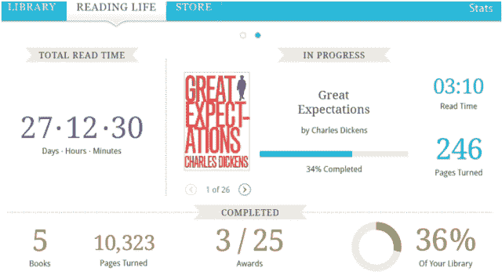

# Kobo 将其 Vox 与 Fire 和 Nook 相抗衡，成为第一款“社交”电子阅读器 

> 原文：<https://web.archive.org/web/http://techcrunch.com/2011/10/19/kobo-pits-its-vox-against-the-fire-and-nook-as-first-social-e-reader/>

我们日常活动的日益社会化(相对于社会化)是值得思考的问题。是什么让人们想要分享每个活动的一切？尤其是阅读，对我来说，更像是一种社交领域的逃避。除了我不得不大声朗读的极少数情况，书籍是一种完全脱离不断连接的网络世界的方式。然而，我不能否认，对于一些人来说，分享和被分享的欲望一定和他们的午餐、活动等一样强烈。

因此，当 Kobo 展示其电子书阅读器并吹捧它是世界上第一款社交[电子书阅读器](https://web.archive.org/web/20230203101927/https://techcrunch.com/tag/e-readers/)时，我持怀疑态度。首先是因为我很确定有很多支持社交的电子阅读器，其次是因为我不确定社交是不是一个 Kobo 应该把所有鸡蛋都放进去的篮子。

竞争激烈得要命。亚马逊的 [Fire](https://web.archive.org/web/20230203101927/https://techcrunch.com/2011/09/28/amazon-kindle-fir/) 被广泛认为是一个潜在的发电站，而 [Nook Color](beta.techcrunch.com/tag/nook-color/) 已经占领了液晶电子阅读器市场的一小部分。我对 Kobo 情有独钟已经有一段时间了，我是他们最初的[和更新的](https://web.archive.org/web/20230203101927/https://techcrunch.com/2010/12/07/review-kobo-e-reader-wireless/)[触摸式](https://web.archive.org/web/20230203101927/https://techcrunch.com/2011/06/13/review-kobo-ereader-touch-edition/)电子阅读器的粉丝，但是我对这个新公司没有信心。

亚马逊之所以能够让 Fire 成为一款引人注目的设备，是因为他们有大量的内容等待提供。除了书籍，还有电影、演出、音乐等等。Nook Color 能够开拓出一个利基市场，因为它有一个真实的身份，并且比其他 Android 平板电脑便宜得多。Kobo 有什么？

嗯，值得称赞的是，它的社交功能在社交读者中非常受欢迎。你知道，读书俱乐部之类的。如果你和你的朋友有足够的资金来组织一个读书俱乐部，这绝对是一个平台。Kobo Pulse 的集成让你可以在阅读时发现并加入对段落和页面的讨论，Vox 是第一款集成脸书 Ticker 的电子阅读器。"德文在 12 秒前翻过了《埃涅阿斯纪》的一页."

谁不喜欢这样的数据呢:

但在 Kobo 独特且潜在有趣的社交电子阅读平台(统称为 Reading Life)之外，它只是另一个稍微过时的 Android 平板电脑，上面有一个皮肤。这些规格不容小觑([它们不久前被泄露](https://web.archive.org/web/20230203101927/https://techcrunch.com/2011/09/29/kobo-vox-android-tablet-leaks-on-retailer-website/))，但它们也没什么特别的。当然，它的定价很有竞争力，为 200 美元，但我不确定我能建议任何人在火上捡起它，严格地基于我在它们身上看到的潜力。说了这么多，我两个都没用过，这里不想做什么实质的推荐。但我不认为 Kobo 有任何东西是亚马逊不能在更新中整合的。这对他们来说是一个危险的处境。

如果你感兴趣，[你可以在 Kobo 的网站上了解更多关于 Vox 的信息。](https://web.archive.org/web/20230203101927/http://www.kobobooks.com/kobovox)你今天可以预订，我想他们很快就会发货。