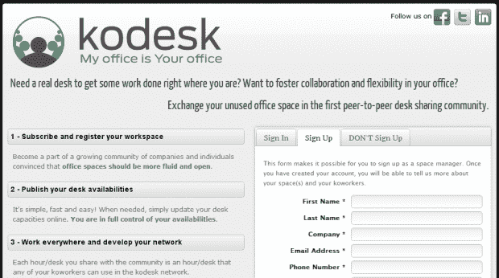

# Kodesk 就像办公空间的 Airbnb 

> 原文：<https://web.archive.org/web/http://techcrunch.com/2011/06/02/kodesk-is-like-an-airbnb-for-office-space/>

# Kodesk 就像是办公空间的 Airbnb

就像 [Airbnb](https://web.archive.org/web/20230204145308/http://www.airbnb.com/) 为旅行者和不需要*留在*的人经营一个市场一样， [Kodesk](https://web.archive.org/web/20230204145308/http://www.kodesk.com/) 也打算为自由职业者和不需要*工作的人经营同样的市场。*

Kodesk 本质上试图建立一个点对点的办公桌共享社区，让办公空间所有者为需要临时场所完成工作的个人提供空间。

这家比利时初创公司刚刚成立，所以他们仍在考虑如何将基本想法转化为可行的业务。

目前，Kodesk 对与他人共享办公桌的公司和个人完全免费，目的是推动 p2p 社区方面的发展。很简单:公司每共享一个小时的桌面空间，他们就可以获得一个小时的时间积分，让他们的任何员工在任何其他 Kodesk 空间使用。

我喜欢 Kodesk 背后的基本理念。毕竟，在全球无数的建筑中有很多闲置的办公空间，越来越多的人可以在任何地方工作，只要有椅子、桌子和互联网连接。

这家初创公司的两位创始人弗雷德里克·纳瓦罗和塞巴斯蒂安·阿波加斯特并不太担心让个人在受欢迎的公司办公室工作的安全问题。尽管我认为公司越大，安全措施就会(也应该)越严格，如果不是为了物理盗窃，而是为了让人们尽可能远离他们的计算机网络。

但对于小企业来说，这是可行的，纳瓦罗和阿波加斯特表示，一个蓬勃发展的“同桌”社区也可以带来合作、伙伴关系、直接招聘以及员工和公司之间的思想和知识交流，公司邀请他们到他们可用的办公空间工作相对较短的时间。

这就是为什么他们称办公室里无人使用的桌子不仅是浪费能源和经济负担，也是“错失意外之喜的机会”。

这是一个很容易被忽略的概念，但每个人都应该好好看看几年前 Airbnb 成立时人们是如何看待它的。投资者对它们的估值不到 10 亿美元。

