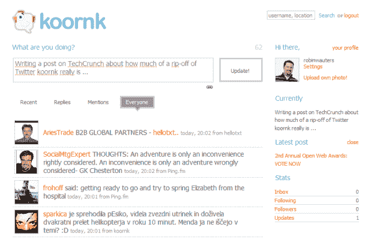

# Koornk 公然抄袭 Twitter TechCrunch

> 原文：<https://web.archive.org/web/http://techcrunch.com/2008/11/27/koornk-blatantly-rips-off-twitter/>

# Koornk 公然抄袭 Twitter

现在有很多 Twitter 的复制品，通常是由美国以外的公司创建的，他们试图通过创建带有翻译应用程序的本地社区来抢走公司的风头，这家旧金山初创公司迄今为止还很少关注这一点。这并不总是通往成功的捷径，去年德国推特的克隆人嘟嘟酷在易贝上出售自己就证明了这一点。并不是说有灵感就一定是坏事。

在 [Yammer](https://web.archive.org/web/20230203012258/http://www.yammer.com/) 和 [Present.ly](https://web.archive.org/web/20230203012258/https://presentlyapp.com/) 的例子中，它是关于获取 Twitter 的核心功能，并利用它做一些有益于商业环境中的团队而不是个人的事情。还有其他克隆人的例子，他们采用与其他人分享短信的概念，并用它做了一些新鲜的事情，比如 [Gospelr](https://web.archive.org/web/20230203012258/http://techcrunch.com/2008/09/18/gospelr-twitter-for-christians/) (是的，针对基督徒) [Blip.fm](https://web.archive.org/web/20230203012258/http://blip.fm/) (针对[音乐爱好者](https://web.archive.org/web/20230203012258/http://techcrunch.com/2008/05/12/twitter-for-music/))或者——为什么不呢——迎合那些对成人内容感兴趣的人( [Twatr](https://web.archive.org/web/20230203012258/http://techcrunch.com/2008/04/01/twatrnet-adult-twitter-clone/) )。也有像 Identi.ca 这样的项目采用去中心化的方法来实现 Twitter 概念，甚至还有像 Twingr 或 T21 Revou 这样的东西，它们可以让你建立/托管自己的 Twitter 社区。

我更不尊重的是像 koor NK T1 这样的服务，它们克隆了 Twitter 的一切，却没有添加任何有价值的东西，也没有从新的商业角度来看待这个概念。事实上，Koornk 更糟糕的是，他们剽窃了太多 Twitter 的布局和措辞，以至于不再有趣。从典型的鸟标志到配色方案，图标，甚至字体，整个事情只是尖叫 Twitter 给我。我就省去你注册服务的麻烦，在下面加几张截图，你自己判断吧。

