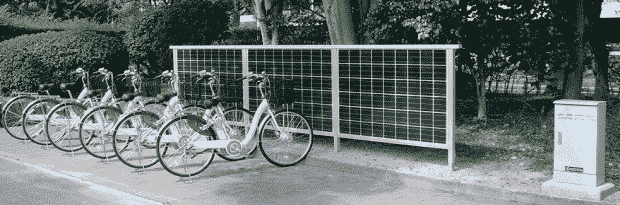

# 京瓷的太阳能循环站:为电动自行车充电的环保站 TechCrunch

> 原文：<https://web.archive.org/web/https://techcrunch.com/2010/11/19/kyoceras-solar-cycle-station-eco-friendly-stand-for-charging-e-bikes/>

# 京瓷的太阳能循环站:为电动自行车充电的环保站

当然，在很多情况下[电动自行车](https://web.archive.org/web/20221007030636/http://search.beta.techcrunch.com/query.php?s=electric+bikes)比汽车更环保，但即使是电动自行车也需要以某种方式充电——大多数时候，电力不是来自环保来源。然而，京瓷昨天[宣布](https://web.archive.org/web/20221007030636/http://www.kyocera.co.jp/news/2010/1101_qazx.html) [JP】一种替代方案:所谓的“太阳能循环站”，本质上是某种自行车架，允许车主通过太阳能为他们的电动自行车充电。

在其标准版本中，自行车支架共有三个太阳能电池模块，最大输出电压为 79.8V(工作电流:7.84A)。京瓷估计，面向南方，每个站每天可以生产 1.14 千瓦时。该支架设计用于六辆电动自行车同时使用。

京瓷表示，在过去的 5 年里，日本的电动自行车销量增长了 50%以上，未来的需求增长甚至会更快，尤其是在电动自行车租赁服务的推动下。但是他们的自行车架售价 23，000 美元，并不便宜(昨天在日本上市)。