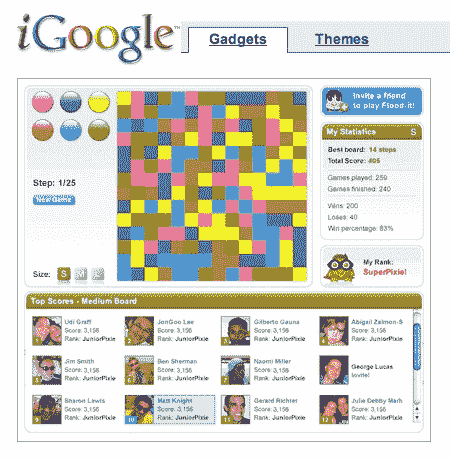

# 谷歌被认为向 LabPixies 支付了 2500 万美元，以使应用程序充斥网络 

> 原文：<https://web.archive.org/web/https://techcrunch.com/2010/04/27/labpixies-google-25-million/>

# 谷歌被认为向 LabPixies 支付了高达 2500 万美元，以使应用程序充斥网络

谷歌今天在以[小规模收购了一家名为](https://web.archive.org/web/20221208091103/http://googlecode.blogspot.com/2010/04/google-acquires-labpixies.html) [LabPixies](https://web.archive.org/web/20221208091103/http://www.labpixies.com/) 的以色列初创公司，这家公司可能以其 Flood-It 而闻名。iPhone 上的游戏(这是新的俄罗斯方块)。但 LabPixies 也以 iGoogle 小工具、脸书应用、Hi5 游戏、MySpace 游戏和 Android 应用的形式创造了大量游戏。谷歌没有透露收购的价格，但以色列风险投资界流传的数字是 1500 万美元到 2500 万美元。(希伯来语中的标记也是[报出 2500 万美元](https://web.archive.org/web/20221208091103/http://www.themarker.com/tmc/article.jhtml?ElementId=gg20100427_85223369)的价格)。对于一家在 2008 年只筹集了 100 万美元天使投资的初创公司来说，这已经不错了。

谷歌收购 LabPixies 是为了将其人才添加到其以色列 R&D 中心，并在网络和移动平台上创建更好的应用程序。这也是谷歌收购的第一家总部位于以色列的初创公司。iGoogle 的唐·勒布在宣布这笔交易的博文中写道:

> 该团队将设在我们不断发展壮大的特拉维夫办事处，并将支撑我们在欧洲、中东和非洲的 iGoogle 工作。我们期待着与 Labpixies 合作开发出色的 web 应用程序，并利用他们的知识和专业技能来帮助开发人员并改善整个生态系统。

然而，LabPixies 擅长的是在网络上开发游戏，并在不同平台上开发不同版本，尤其是 iPhone 和 Android。它的 iGoogle 小工具游戏可能每月产生多达 10 亿次展示，但它的所有收入都来自 iPhone。谷歌现在可能会尝试在 Android 上撒一些 LabPixie 灰尘。一种策略可能是首先为 iGoogle 创建游戏和应用，然后利用 iGoogle 的影响力将这些应用推向 Android。

但是他们最好不要移除洪水-它！从 iPhone 上。我喜欢那个游戏。