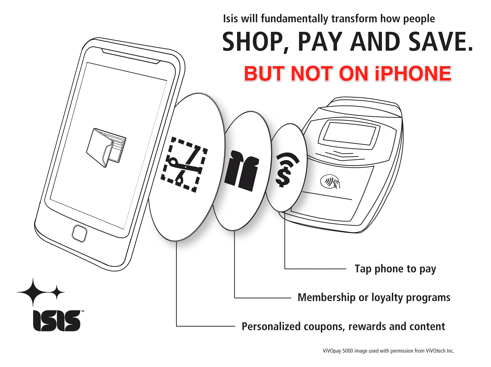

# iPhone 4S 缺少 NFC 不会影响市场 

> 原文：<https://web.archive.org/web/http://techcrunch.com/2011/10/05/lack-of-nfc-in-iphone-4s-wont-impact-market-say-analysts/>

虽然并不完全令人惊讶，但昨天发布的新 iPhone 4S 并没有提到 NFC(近场通信)。虽然许多人希望包含短程无线技术，作为当前和计划中的移动钱包系统的主干，但苹果仍然有足够的时间将 NFC 集成到未来的手机中。NFC 甚至有可能在即将发布的 iPhone 5 中实现。

但是苹果在 iPhone 4S 中跳过 NFC 的决定会对今天的市场产生影响吗？分析师表示，不太可能。

迄今为止，NFC 预测各不相同。ABI 研究公司估计今年将会有 3500 万部手机出货，明年将会翻倍。IHS iSuppli 预测，到 2015 年，手机销量将接近 5.5 亿部。与此同时，Berg Insight AB 预计到 2015 年将有 4 亿部手机。不管真实数字是多少，人们一致认为这项技术还需要几年才能被消费者接受。苹果可以等。

尽管苹果公司做的任何事情都会引起注意，但 ABI 分析师约翰·德夫林表示，他不认为这个消息会对当前的市场状况或趋势产生影响。德夫林告诉我们:“苹果的加入将是 NFC 的一大推动力——即使只是出于竞争的原因。”。“我认为这不会对市场产生负面影响。他表示:“(NFC)一直在升温，公司正在启动，战略也已到位。”。

弗雷斯特研究公司(Forrester Research)的首席分析师 Charles Golvin 同意这一观点，他指出，如果苹果宣布了 NFC，它将推动该行业的发展，并加速竞争对手的产品，但 iPhone 4S 缺乏 NFC 既不是该技术的丧钟，也不是 NFC 长期可行性的声明。

苹果的技能通常是重塑和完善终端用户体验，但它不一定要率先推出一项新技术。就 NFC 而言，市场还没有准备好。

Golvin 解释说:“将设备送到客户手中只是采用的第一步。还需要有支持 NFC 的销售点终端，客户必须能够将他们所有的信用卡信息输入到他们的手机钱包中。“在手机钱包和你真正的钱包一样之前，它不会真正飞起来，”Golvin 说。

例如，今天只有花旗银行品牌的万事达卡可以在[谷歌钱包](https://web.archive.org/web/20230214055042/http://www.google.com/wallet)中使用，运营商主导的移动钱包项目 [Isis](https://web.archive.org/web/20230214055042/http://www.paywithisis.com/) 还没有推出。

除了总体市场准备情况之外，影响苹果推迟 NFC 的另一个因素是苹果在进入竞争格局时具有颠覆性的潜力。“苹果喜欢拥有生态系统，但现有的支付网络太根深蒂固了，”德夫林说。“然而，苹果现金充裕得令人难以置信，因此收购一家支付相关公司不是不可能的。”

“同样，为了最大化 NFC 以及它可以提供的不同用户体验，”他继续说道，“在一系列产品中采用 NFC 是有意义的，如 iPad、MacBooks 等。，而这些升级还没有准备好。”

与此同时，其他公司正在推出自己的 NFC 支付系统。如上所述，谷歌有谷歌钱包。美国电话电报公司、T-Mobile 和威瑞森的合资公司 Isis 最近宣布，包括 HTC、LG、摩托罗拉、RIM、三星和索尼爱立信在内的大多数领先设备制造商支持其移动钱包系统。NFC 在其他领域也取得了进展，比如 Windows 8 平板电脑——苹果可能会密切关注这一领域。

ABI 表示，不会因为 iPhone 4S 而改变对 NFC 预测的立场。它仍然预计 2012 年将有 8000 万部 NFC 手机，并相信苹果将在一两年后进入一个更发达的生态系统。

Forrester 没有具体的手机预测，但 Golvin 说，到 2012 年底到 2013 年年中，这项技术将更加普及。高尔文说，到那时，“将很难找到不包含 NFC 功能的智能手机。”

也许支持 NFC 的 4G iPhone 5 也会出现。