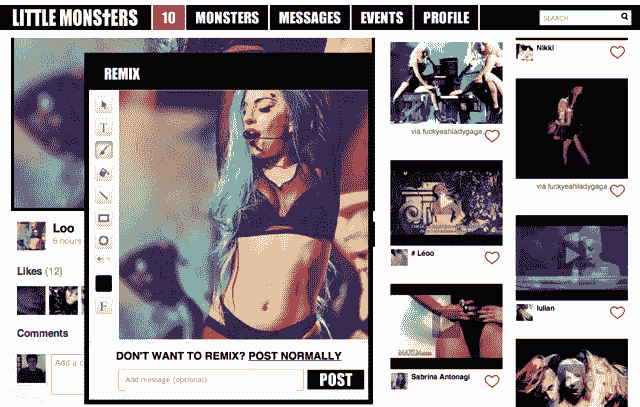
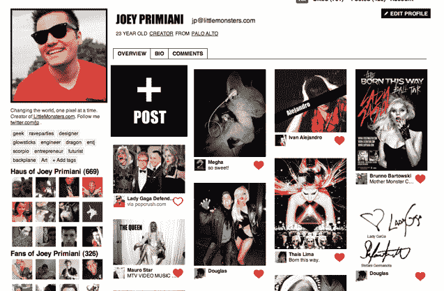

# Lady Gaga 支持的背板从红杉资本筹集超过 400 万美元；收购共享平台 Cortex | TechCrunch

> 原文：<https://web.archive.org/web/https://techcrunch.com/2012/02/16/lady-gaga-backed-backplane-raises-over-4m-from-sequoia-more-acquires-sharing-platform-cortex/>

你现在可能已经听说过一个年轻的创业公司，它受到一些令人印象深刻的明星力量的推动，包括独一无二的 Lady Gaga。该项目名为[背板](https://web.archive.org/web/20230330230104/http://thebackplane.com/)，由 Lady Gaga 的经理特洛伊·卡特(Troy Carter)共同创立，并从一系列令人印象深刻的投资者那里筹集了早期(然后嘘嘘)种子轮投资，包括谷歌风险投资公司、创始人基金天使投资公司、Menlo 风险投资公司、SV 天使投资公司、i/o 风险投资公司和明天风险投资公司。

这家初创公司也由一群前脸书和谷歌员工以及其他高科技公司领导，包括前谷歌员工、Cortex 创始人乔伊·普里米亚尼(Joey Primiani)、Palantir Technologies 前运营总监(也是第一名员工)亚历克斯·摩尔(Alex Moore)，以及 Panantir 联合创始人乔·朗斯代尔(Joe Lonsdale)，后者已成为 Backplane 董事会主席。

这家初创公司正在利用其明星影响力和技术缓存，除其他外，[在 SXSW](https://web.archive.org/web/20230330230104/https://techcrunch.com/2012/02/06/backplane-to-hold-music-hackathon-at-sxsw-with-top-industry-managers-as-judges/) 举办音乐黑客马拉松——将由音乐行业的资深人士评判，比如帮助你带来比伯的 Scooter Braun——以继续吸引顶级工程师到它的平台上。

有很多技术发展和战略被应用到平台上，以支持初创公司的创始价值主张，简而言之，就是改变传统中介将粉丝与艺术家联系起来的方式。换句话说，它是一个社区平台，结合了 Pinterest、Tumblr、Canvas 和 Ning 的功能，以大幅提升以社区为中心的平台的参与度为名，汇集了社交和视觉设计的最有效部分。

Backplane 始于 LittleMonsters.com 的 T4，这是第一个由 Backplane 支持的门户网站，也是 Lady Gaga 和她的粉丝大军的新在线社区。当然，这只是一个开始，这家初创公司希望创建一个社区网站的牛棚，不仅面向品牌和名人，还面向几乎任何利益群体。

但是“社区”在背板环境中是什么意思呢？在 LittleMonsters 的例子中，Backplane 提供了网站范围内的“喜欢”图标、社交评论、照片捕捉和编辑，以及与谷歌日历和 Gmail 的集成等等。

但 Backplane 的社区游戏的真正关键，营销主管 Sarah Ross(早期的 TechCruncher)说，是一个 i/o 风险投资孵化的共享平台和浏览器扩展，称为 [Cortex](https://web.archive.org/web/20230330230104/https://techcrunch.com/2010/12/15/cortex-chrome/) 。Cortex 由开发人员 Eric Wolf 和 Joey Primiani 开发，旨在通过一种简单的方式将社交功能集成到我们的网上冲浪中。就像 MG 当时写的那样，Cortex 没有修改 Chrome 的 UI 元素，而是给任何网站添加了一个共享覆盖层。你所要做的就是点击你的鼠标并按住它。

会弹出一个提示，让你分享到脸书、Twitter、Tumblr 等等。它会自动找到合适的图片和标题，允许你添加信息，并通过社交网络发布出去。关键是简单和速度。当 Primiani 与未来的背板联合创始人 Moore 和现在的首席执行官 Matt Michelsen 联系时，他们被这项技术惊呆了，并立即着手收购它。Backplane 今天正式宣布完成对 Cortex 的收购，并宣布该技术正在推动 Backplane 上的所有社交聚合。

不仅如此，除了初创公司筹集的 180 万美元种子资金(如前所述)，Backplane 今天完成了一轮 A 轮融资，增加了其已经令人印象深刻的硅谷投资者，包括红杉资本、Greylock Discovery Fund、Battery Ventures、Formation 8 和 Advanced Publications Inc .。尽管初创公司没有透露确切的数字，但我们已经确认该轮融资在 400 万美元至 500 万美元之间，正如《华尔街日报》最初报道的。这使得这家初创公司的总资金在一年多一点的时间里就超过了 600 万美元。

据《华尔街日报》报道，这轮融资以可转换债券的形式进行，以使这家初创公司在筹集 B 轮融资时有更大的灵活性。LittleMonsters 社区正处于受控制的公开测试阶段，所谓受控制，我们指的是早期测试有成千上万的注册。TechCrunch 很早就看到了 Gaga 的背板社区，你可以点击这里查看。

除此之外，该社区还提供了一些漂亮的聊天功能，用户可以用任何语言相互发送即时消息，并将其实时翻译成收件人选择的语言。这位首席执行官告诉我们，该网站大约一半的早期测试者来自巴西，中国和其他国家也有兴趣。毫无疑问，这将有助于底板网站成为关于 Lady Gaga 的国际交流中心，很快就会有更多的团体和品牌。仅从这些科技天才的点滴中，人们就开始明白为什么硅谷高管会有这么大的早期兴趣。尽管有 Gaga Nation 的支持肯定没什么坏处。

LittleMonsters.com 将于今年春天上线，今年将会有更多的社区上线。

更多信息，[点击这里](https://web.archive.org/web/20230330230104/http://thebackplane.com/)查看家里的背板。

