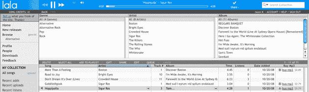

# 拉拉可能刚刚开创了数字音乐的下一场革命 TechCrunch

> 原文：<https://web.archive.org/web/https://techcrunch.com/2008/10/20/lala-may-have-just-built-the-next-revolution-in-digital-music/>

叫我怀疑论者吧。当[拉拉](https://web.archive.org/web/20221201173821/http://www.lala.com/)上周来到我们的办公室，试图让我相信音乐正在走向云端，他们将帮助引领这一转变时，我起初并不相信。该公司挣扎了多年，从一家 CD 交换服务公司[转型为一家失败的音乐中心](https://web.archive.org/web/20221201173821/http://www.beta.techcrunch.com/2006/10/10/lala-leverages-internet-radio-for-cd-swapping-sales/)[，并于去年夏天关闭。但是现在他们已经完全重新设计了，并且带着一个没有广告的音乐网站回来了，这让我觉得他们可能会在这里有所作为。](https://web.archive.org/web/20221201173821/http://www.beta.techcrunch.com/2007/05/29/free-legal-on-demand-steaming-music-lala-is-going-to-give-it-a-shot/)

乍一看，Lala 与大多数其他音乐商店相似。你可以使用搜索框来找到你喜欢的艺术家，并且可以以大约 90 美分的价格购买无数字版权管理的音乐(根据歌曲的不同会有一些细微的变化)。每个页面都有一个艺术家简介、他们的专辑和其他用户包含他们的播放列表。这是标准价格，尽管无数字版权管理的音乐很好，但仅凭它自己，很难与亚马逊竞争。

幸运的是，Lala 的真正潜力来自其集成的媒体播放器和你的网络图书馆(看起来很像 iTunes，但在云中)。屏幕顶部是一个音乐播放器，无论你在网站的哪个位置浏览，它都会继续播放你听的任何歌曲。而且你会有很多内容可以播放:用户将可以免费播放该网站海量目录中的任何歌曲，而且一次就可以播放完。起初，这种限制听起来很严格，但购买一首“网络歌曲”只需 10 美分——这让你能够在未来任意多次播放这首歌曲。如果你决定以后买普通的 MP3，那 10 美分将用于你的购买。

这个 10 美分的价格点令人难以置信地上瘾，并且对 Lala 的盈利战略至关重要(给用户 50 首免费网络歌曲，让他们习惯这个想法)。首席执行官杰夫·罗尔斯顿解释说，其他网站，如 imeem 或 MySpace Music，需要用广告淹没用户来赚钱——这不利于良好的音乐收听体验。相反，拉拉希望你听尽可能多的音乐，希望你会一直点击那个令人上瘾的 10 美分的“网络歌曲”按钮，并完全放弃广告。结果非常令人耳目一新。

Lala 也做了一些严肃的法律辩论来帮助你填充你的在线图书馆。使用该网站的助手应用程序(可在 Windows 和 Mac 上使用)，Lala 可以扫描你的 iTunes 音乐库，并将你已经拥有的每首歌曲添加到你的 Lala 网络库中，本质上是让你在线流媒体访问你电脑上已经存在的任何歌曲。最棒的是:Lala 将让你免费、无限制地观看你图书馆里的每首歌曲，甚至是那些你以不太合法的方式获得的歌曲。罗尔斯顿说，唱片公司起初抵制这一点(“为什么我们要让他们访问他们偷的东西”)，但最终得出的结论是，用户不会购买他们已经下载的东西。

拉拉已经与所有四大唱片公司和 175，000 名独立艺术家签约，加入其庞大的图书馆。偶尔仍有一些歌曲没有获得完全许可(例如，你不能买到任何齐柏林飞船歌曲的 10 美分版本)，但这可能会在未来发生变化。

真正的问题是音乐是否真的准备好了走向云端。似乎其他一切都是如此——无论是电子邮件和 Word 等桌面应用程序，还是照片等富媒体。随着 iPhone 等高速移动设备的日益普及，用户不再担心同步和传输音乐，而只是从中央服务器传输音乐，这似乎只是时间问题。我不确定用户会不会对不拥有他们任何网络歌曲的完整拷贝感到舒服(当 Lala 关闭时会发生什么？)，但是为了 10 美分，值得一试。