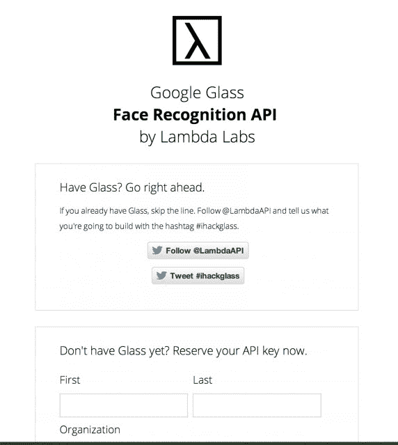

# Lambda Labs 正在为谷歌眼镜 TechCrunch 推出面部识别 API

> 原文：<https://web.archive.org/web/https://techcrunch.com/2013/05/23/lambda-labs-is-launching-a-facial-recognition-api-for-google-glass/>

旧金山的初创公司 Lambda Labs 正准备为谷歌眼镜应用程序的开发者发布面部识别 API[。公司联合创始人斯蒂芬·巴拉班说，感兴趣的开发者将在一周内获得该 API。此前，国会对谷歌新的可穿戴技术进行了调查，该技术在很大程度上仍处于原型阶段。](https://web.archive.org/web/20230114124517/http://glass.lambdal.com/)

这家初创公司的面部识别 API[于去年推出测试版](https://web.archive.org/web/20230114124517/https://techcrunch.com/2012/09/04/following-facebooks-shut-down-of-face-coms-facial-recognition-api-lambda-labs-debuts-an-open-source-alternative/)，已经被 1000 名开发者使用，其中包括几家大型国际公司。现在每月有超过 500 万个 API 调用，并且每月以 15%的速度增长。Balaban 还表示，自去年 11 月以来，该公司的现金流一直是正的。

现在，同样的 API 已经被[专门为谷歌眼镜应用](https://web.archive.org/web/20230114124517/http://glass.lambdal.com/)定制，以实现面部和物体识别。

Balaban 解释说，这项技术应用于谷歌眼镜，将实现诸如“记住这张脸”、“在人群中找到你的朋友”、“社交活动兴趣匹配”、“智能通讯录”等应用。(你可以在这里看到开发者在推特上谈论什么应用[。)](https://web.archive.org/web/20230114124517/https://twitter.com/search?q=%23ihackglass)

尽管这项技术听起来可能令人惊讶/恐惧，但任何使用该技术的应用程序都无法实时做到这一点——也就是说，你不能只是四处走动，自动识别你透过眼镜看到的人。谷歌的镜像 API 目前的工作方式是，你首先必须拍摄一张照片，将其发送到开发者的服务器，然后获得通知。滞后时间至少会有几秒钟，这取决于你拍照和分享的速度。然而，即将推出的谷歌眼镜软件开发工具包(SDK)可能会改变这一点。

“Glass 服务条款中没有明确禁止我们这样做。然而，有一个风险，谷歌可能会改变 ToS，试图阻止我们提供这一功能，”巴拉班说。“这是第一个用于谷歌眼镜的人脸识别工具包，所以我们不确定谷歌或隐私小组会作何反应。”

他所指的隐私会议与本月早些时候的国会调查有关，八名国会议员[向](https://web.archive.org/web/20230114124517/http://joebarton.house.gov/images/GoogleGlassLtr_051613.pdf)谷歌首席执行官拉里·佩奇询问了六个关于谷歌眼镜的功能和对用户隐私的潜在影响的问题。由得克萨斯州共和党人乔·巴顿领导的两党隐私核心小组想知道谷歌眼镜是否会在未经用户同意的情况下收集用户数据，谷歌在批准第三方应用程序之前是否会考虑隐私等一系列问题。

其中一个问题是谷歌眼镜是否支持面部识别。谷歌眼镜产品管理总监李家鼎已经回答了这个问题。在提交给[纽约时报](https://web.archive.org/web/20230114124517/http://www.nytimes.com/2013/05/17/technology/lawmakers-pose-questions-on-google-glass.html?_r=0)的一份声明中，他回答说，“我们一直说我们不会在我们的服务中增加新的人脸识别功能，除非我们有强有力的隐私保护措施。”

当然，这不是一个明确的“不”。更像是“不，暂时不要”谷歌眼镜只是一项太新的技术，无法开始限制它会做什么或不会做什么，至少在如此明确的条款中是如此。

然而，面部识别似乎并没有在[谷歌的 API 政策](https://web.archive.org/web/20230114124517/https://developers.google.com/glass/policies#c_what_you_cant_do_in_your_application)中被明确禁止，这些政策告诉眼镜开发者他们在应用程序中可以做什么，不可以做什么。这意味着，至少在目前，Lambda 为眼镜开发者提供的面部识别 API 将被允许。

根据谷歌的政策，影响其使用的唯一原因是，谷歌眼镜“不打算用于可能受特定行业隐私法规约束的应用和服务。”

显然，立法者仍然可以制定这样的政策，如果他们愿意的话。

“假设谷歌和乔·巴顿的隐私核心小组不试图阻止我们，[API]将在一周内对每个人开放，”Balaban 说。

应该指出的是，谷歌早就有技术开发能够进行面部识别的应用程序，但一直非常谨慎，以免引发隐私反弹。

2011 年，[有报道称](https://web.archive.org/web/20230114124517/http://www.cnn.com/2011/TECH/mobile/03/31/google.face/index.html)谷歌正在开发一款手机应用，用户可以通过拍摄人脸来获取个人信息。这款应用一直没有出现，但面部识别已经出现在谷歌的照片共享服务 Google+ Photos(之前的 Picasa)中，用户现在可以选择让他们的面部被识别。这使得寻找“你的照片和视频变得容易，”T2 解释说，该公司的文件关于这项技术。

或许有一天，用户也能“选择”让谷歌眼镜应用识别他们的脸？

时间——以及国会的反应——会证明一切。

*图片鸣谢:[来自杰克摩根运球上的玻璃概念](https://web.archive.org/web/20230114124517/http://dribbble.com/shots/1069033-Google-Glass-Facial-Recognition-with-Google-WIP)；补充报道:弗雷德里克·拉迪诺斯*