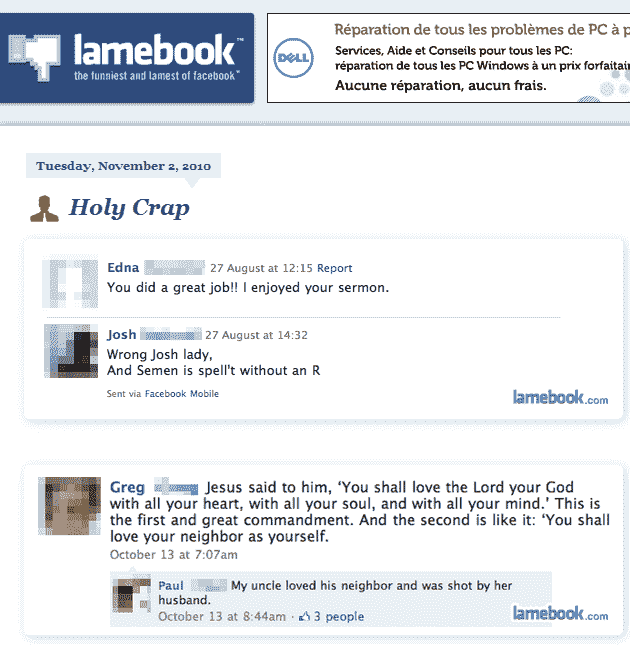

# Lamebook 起诉脸书商标侵权。等等，什么？

> 原文：<https://web.archive.org/web/https://techcrunch.com/2010/11/05/lamebook-vs-facebook/>

# Lamebook 起诉脸书商标侵权。等等，什么？

这里有一个令人挠头的问题，至少乍一看是这样的: [Lamebook](https://web.archive.org/web/20230214040311/http://www.lamebook.com/) ，一个搞笑的广告支持网站，让[脸书](https://web.archive.org/web/20230214040311/http://www.crunchbase.com/company/facebook)的用户提交有趣的状态更新、图片和来自社交网络的“其他宝石”，显然是[起诉脸书](https://web.archive.org/web/20230214040311/http://dockets.justia.com/docket/texas/txwdce/1:2010cv00833/454001/)商标侵权。

Lamebook 是由得克萨斯州奥斯汀的两位平面设计师(Jonathan Standefer 和 Matthew Genitempo)于 2009 年 4 月推出的，它的名称、标志和配色方案显然受到了脸书品牌的“启发”。

所以这里是怎么回事。该投诉是为了宣告式判决，这意味着脸书威胁要起诉 Lamebook 侵犯商标，现在这家小公司先起诉他们，以便从法院获得先发制人的决定，即事实上没有任何不当行为。最有可能的是，Lamebook 这样做是为了让诉讼继续在德州进行。

根据诉状，脸书律师在 2010 年 3 月首次联系 Lamebook，要求他们停止使用 Lamebook 标志，并改变其网站的名称和外观。在接下来的几个月里，他们多次重复这一要求，现在威胁要将这家小公司告上法庭，以达到他们的目的。

基本上，Lamebook 的反驳是，它的网站是对脸书的明显模仿，因此没有侵犯或淡化脸书商标，并受到美国宪法第一修正案的保护。

所有这些都不令人惊讶。请记住，脸书早些时候因为名称中有“书”这个词而对 [Teachbook](https://web.archive.org/web/20230214040311/http://teachbook.com/) 和 [Placebook](https://web.archive.org/web/20230214040311/https://techcrunch.com/2010/08/10/facebook-placebook/) 穷追猛打——我建议接下来他们可以[欺负或起诉](https://web.archive.org/web/20230214040311/https://techcrunch.com/2010/08/26/facebook-placebook-teachbook/)其他一些公司，但实际上没有提到 Lamebook。

我就这种紧张局势联系了脸书和 Lamebook，但他们都没有立即回应。当我们了解更多信息时，我们会更新。

**更新:**脸书给我们发来了这样的回复:

“不幸的是，在与 Lamebook 合作了几个月，友好地解决了我们认为的建立一个利用脸书的知名度和声誉的品牌的不正当企图之后，他们转向了诉讼。我们对自己的立场充满信心，相信我们会在法庭上获胜。”

(感谢来自 [Priorsmart](https://web.archive.org/web/20230214040311/http://www.priorsmart.com/) 的凯尔的帮助)

您可以在下面找到投诉:

这是 Lamebook 的一些有趣的内容:

