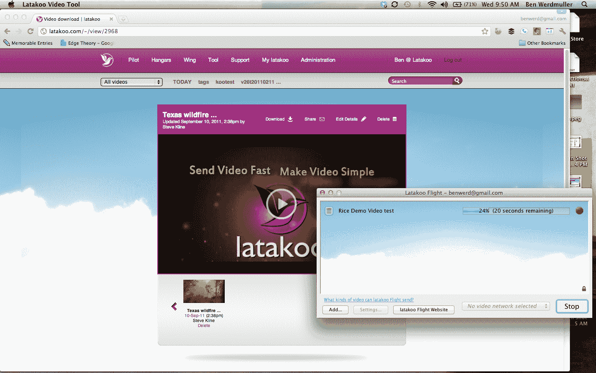

# Latakoo 快速移动高清视频，非常适合新闻编辑室 TechCrunch

> 原文：<https://web.archive.org/web/https://techcrunch.com/2011/09/16/latakoo-moves-hd-video-fast-works-great-for-newsrooms/>

总部位于奥斯汀的视频初创公司 [latakoo](https://web.archive.org/web/20230203135036/http://latakoo.com/) 有一个有趣的名字(它是[某种玩笑](https://web.archive.org/web/20230203135036/http://en.wikipedia.org/wiki/Latakoo_Lark))，但是一个伟大的想法:让传输高清视频更容易。该公司由一群记者和技术专家建立，旨在解决新闻编辑室环境中视频共享的现实问题，已经吸引了 200 多名付费客户，包括许多电视台集团。有了 latakoo 的工具 Flight，摄像师可以在几分钟内快速压缩和上传大型视频文件。这些视频存储在 latakoo 基于网络的云应用程序中，可以私下与同事分享，他们可以在自己的终端上下载更小、更压缩的文件。

该公司称，这款工具是一款在电脑上运行的软件程序，可以将高清视频压缩至原始视频文件大小的 1.5%至 5%，同时仍能保持视频的质量和分辨率。它使用的压缩技术并不新鲜——事实上，它们是开源技术，只是针对初创公司的目的进行了更好的优化。输出的视频以 MPEG4 格式提供，所有音频通道保持不变，这是编辑时经常需要的。

通过网络共享的视频从不公开，只对那些明确共享的人开放。这使得 latakoo 非常适合新闻编辑室环境，或者任何其他需要以更高效的方式移动大型视频文件的公司。视频也可以通过电子邮件在网络之外共享。未登录的用户会收到一封指向下载页面的链接邮件。

令人难以置信的是，新闻编辑室里的视频分享通常仍然是通过非常老式的方法进行的，这是 latakoo 的创始人从第一手经验中了解到的。在采用这项服务之前，它的一些客户使用磁带共享视频，通过卫星连接同步服务器，FTP 或 YouSendIt 等文件共享服务。虽然后者可以共享大文件，但上传高清视频到文件共享服务的过程非常慢。

今年夏天早些时候，Latakoo 进行了一次试运行，利用记者创始人在业内的关系，将产品播种到少数新闻编辑室进行测试。从那以后，通过口口相传的推荐，这个词就像病毒一样传播开来。公司后续的客户群其实是找上门来的，而不是反过来。此外，由于 latakoo 不是免费服务，其所有客户都已经为该产品付费。目前有几个[支付等级](https://web.archive.org/web/20230203135036/http://latakoo.com/-/pricing/)，主要是基于视频传输分钟数的月费率。有一个按分钟付费的计划可供偶尔的视频爱好者用户使用。

经营 TechCrunch 电视台的乔恩·奥林最初是一个怀疑论者。但他做了一些测试和真实世界的测试，并留下了深刻的印象。Orlin 说“Latakoo 为我们解决了一个真正的问题。我们最近在阿斯彭为我们的节目拍摄了一些大型高清视频文件。Andrew Keen 能够使用简单的压缩和上传软件将文件发送给我们进行编辑。如果没有 Latakoo，光是上传文件就要花至少 6 个小时。我们能够在不到 30 分钟的时间内完成传输并开始编辑。而且质量完全可以接受，即使是在大量文件压缩之后。”奥林补充说，还有其他方法来传输大型视频文件，但大多数涉及昂贵的硬件或软件。

就在本周的 TechCrunch Disrupt 大会之前，该公司完成了 130 万美元的种子融资。这笔钱将用于发展公司和产品，首先是在未来几周推出更多功能和改进，包括将压缩视频上传到 YouTube 或发布到脸书和 Twitter 的社交共享机制。Latakoo 也有一个 API，它将允许内部开发人员在该服务的基础上构建应用程序，例如自动下载视频。

感兴趣的用户可以在这里报名加入 latakoo 的等候名单[。](https://web.archive.org/web/20230203135036/http://latakoo.com/-/waitingList/)

*更新:美国东部时间下午 3:30，Latakoo 的 Ben Werdmuller von Elgg 通知我们，他之前给我们的付费客户数量是错误的(40)。他说，实际数字现在超过了 200。我们已经更新了帖子以反映这一变化。*