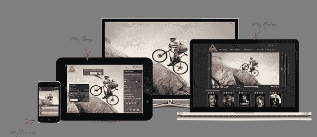

# 多屏视频商店平台 Latto 再融资 400 万美元 

> 原文：<https://web.archive.org/web/https://techcrunch.com/2013/07/31/latto-raises-4m/>

# 多屏视频商店平台 Latto 再融资 400 万美元

多屏视频商店平台 [Latto](https://web.archive.org/web/20221007105312/http://www.latto.tv/) ，为希望参与多屏流媒体和点播视频活动的电信公司、广播公司和内容聚合商提供白标解决方案，已经完成了一轮 400 万美元的融资，增加了这家以色列初创公司之前筹集的 1100 万美元。

新的投资来自一个不知名的卢森堡私人基金，尽管根据 CrunchBase [的数据](https://web.archive.org/web/20221007105312/http://www.crunchbase.com/company/latto)这可能是以前的支持者 [Neurato Investments](https://web.archive.org/web/20221007105312/http://www.crunchbase.com/company/neurato-investments) 。Latto 的其他早期投资者包括 [2B 天使](https://web.archive.org/web/20221007105312/http://www.crunchbase.com/financial-organization/2b-angels)和 [Plus Ventures](https://web.archive.org/web/20221007105312/http://www.crunchbase.com/financial-organization/plus-ventures) 。

在一个越来越拥挤的市场中运营——Latto 的竞争对手包括 Platform、SeaChange、Quickplay 和 Ooyala，以及电信市场端的思科和爱立信——该公司正在利用所谓的“割线”趋势，即消费者对“Over-The-Top”(OTT)视频的接受。此外，多种设备(个人电脑、智能手机、机顶盒、联网电视和平板电脑)的出现也带来了对多屏解决方案的需求，提供针对不同屏幕分辨率和编解码器支持并与之互操作的视频资产。

为此，Latto 正在宣传其个性化和电子商务功能，这些功能提供了帮助客户将其内容和多屏产品货币化的新方法。具体来说，这是以 Latto Shop 的形式出现的，它使运营商能够为内容和商业提供个性化的优惠和广告以及“交互式媒体商店”。

一种将 Latto shop 视为视频观看体验中的电子商务网站的方式是，提供由平台捕获的“大数据”驱动的个性化内容和产品，包括来自观众的数据——观众是谁、在哪里、他们喜欢什么、他们的观看和购买行为——以及从内容和所推广的产品中收集的数据。

对运营商的宣传是，除了核心的 OTT 产品，Latto Shop 还能提供额外的增量收入流。

就现有客户而言，这家初创公司不能公开透露它目前支持哪些运营商的多屏产品，可能是因为商业协议，不过快速浏览一下 Latto 以前的公关可以发现，其中许多产品都位于亚洲。