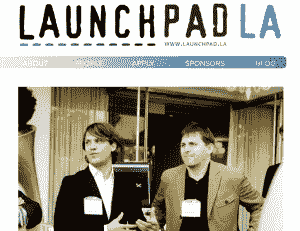
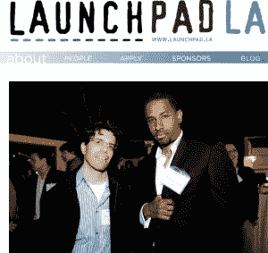
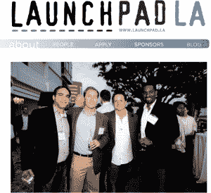

# Launchpad LA 获得风险投资:每个初创公司 5 万美元 

> 原文：<https://web.archive.org/web/http://techcrunch.com/2011/11/08/launchpad-la-receives-vc-funding-50000-per-startup/>

Launchpad LA 今天宣布，它将接受洛杉矶第三类科技创业公司的申请。这里有重要的风险投资承诺(如下所列)——每个进入的公司将获得 5 万美元的资金、顶级风险投资家和成功企业家的指导以及免费的办公场所。任何有兴趣申请[的公司请访问网站](https://web.archive.org/web/20230203095752/http://www.launchpad.la/index.php/apply)。

**历史**
在过去的两年半时间里，洛杉矶有一个名为 Launchpad LA 的项目。

该组织有四个目标:

*   为一些总部设在洛杉矶或愿意搬迁到洛杉矶的最有前途的年轻公司提供指导
*   让以下人士了解这些公司:资金来源(天使/风险投资)、业务发展伙伴、自己建立了成功公司的导师、媒体和潜在雇员
*   向这些公司证明他们可以留在洛杉矶。这里有一个强大的生态系统，伟大的领导者和建立有巨大出口的公司的能力。
*    为风投和高管提供一个参与社区的机会，回馈社会，而不仅仅是参加更多的鸡尾酒会

**成绩单**

Launchpad LA 做得怎么样？23 家公司通过了 Launchpad LA。其中 19 家获得了融资(10 家获得了大量风险投资)，5 家被收购(2 家超过 3000 万美元)。但最重要的指标是与初创公司以及高管之间建立的深厚而持久的关系。Launchpad LA 的一位高级导师最近说，

> “我从 Launchpad LA 得到的比我投入的还要多。我指导过的一个人现在是纽约 AOL 的高级主管。我的公司与他们正在做的事情密切相关，因此在高层有一个倡导者肯定会有所帮助。”

我们经常收到这样的反馈。

**那么三班有什么不同呢？**
该项目前两年的重点是教育&导师制。专家们定期讨论一些活动:筹资、条款清单、组建团队、产品开发、建立商业发展伙伴、并购、与媒体打交道等等。这种教育将继续下去。 

但今年有两个新的组成部分:资金和设施。

每家公司将获得 5 万美元。几家基金和公司参与了此次投资，包括 [Rincon Ventures](https://web.archive.org/web/20230203095752/http://rinconvp.com/) 、[Idealab](https://web.archive.org/web/20230203095752/http://www.idealab.com/)([Bill Gross](https://web.archive.org/web/20230203095752/http://www.idealab.com/about_idealab/management/bill_gross.html)建立了最初的孵化器，并将得到[艾伦摩根](https://web.archive.org/web/20230203095752/http://www.idealab.com/about_idealab/board/allen_morgan.html)、[巴罗达风险投资](https://web.archive.org/web/20230203095752/http://www.barodaventures.com/team.html)、 [GRP Partners](https://web.archive.org/web/20230203095752/http://www.grppartners.com/) 、[大卫科恩](https://web.archive.org/web/20230203095752/http://www.davidgcohen.com/)([tech stars](https://web.archive.org/web/20230203095752/http://www.techstars.org/)的创始人)、[大卫蒂施](https://web.archive.org/web/20230203095752/http://www.davidtisch.com/)([tech 的创始人](https://web.archive.org/web/20230203095752/http://www.techstars.com/program/locations/nyc/)

办公空间将是免费的，位于圣莫尼卡，步行即可到达第三大街步行街。

每个本地参与的风险投资公司每周至少有 1 天会在这里工作，并计划花时间积极参与 Launchpad LA 的任何公司。

还有一个了不起的风险投资和个人顾问小组，他们将帮助参与 Launchpad LA 并指导其发展方向，包括:

**风投:** [500 家创业公司](https://web.archive.org/web/20230203095752/http://500.co/)， [BlueRun Ventures](https://web.archive.org/web/20230203095752/http://www.brv.com/) ，[首轮资本](https://web.archive.org/web/20230203095752/http://www.firstround.com/)，[代工集团](https://web.archive.org/web/20230203095752/http://www.foundrygroup.com/)，[Menlo Ventures](https://web.archive.org/web/20230203095752/http://www.menlovc.com/team_bio.html?id=25)(Shervin Pishevar)[MK Capital](https://web.archive.org/web/20230203095752/http://www.mkcapital.com/)
**个人:** [Jason Calacanis](https://web.archive.org/web/20230203095752/http://calacanis.com/) ， [Paul Kedrosky](https://web.archive.org/web/20230203095752/http://paul.kedrosky.com/) ，[Peter Levin](https://web.archive.org/web/20230203095752/http://www.geekchicdaily.com/geek/about/)(T22)

除了伟大的导师之外，这个名单还在不断增加。

超级巨星萨姆·泰勒加入了 Launchpad LA 的运营。他之前与人共同创立了洛杉矶媒体公司和互动机构 [Charlie](https://web.archive.org/web/20230203095752/http://www.meetcharlie.com/) ，在那里他为塞缪尔·L·杰克逊、Tumblr 和 Dick Clark Productions 工作。山姆也是巴拉克·奥巴马总统竞选和新媒体团队的成员，之前曾为谷歌、瑞士瑞信银行、科尔伯特报告以及参议员约翰·克里和希拉里·克林顿工作。Sam 在洛杉矶出生和长大，因此是洛杉矶创业社区的重要支持者。他获得了哈佛大学的学士学位，在哈佛他是《哈佛讽刺》的业务经理。

亚当·利林将继续积极领导 Launchpad LA 的运营。Adam 在通过资助帮助我们许多上一届学生方面发挥了实际作用，甚至获得了一些董事会席位和顾问角色。山姆&亚当将和[乔希·韦伯](https://web.archive.org/web/20230203095752/http://twitter.com/#!/websterisk)一起工作，他是我的同事，之前在 Idealab 工作。

**但是，等等，这是否意味着 Launchpad LA 现在是一个孵化器？我们一直希望被视为一个“导师组织”,要求人们回馈他们的社区。但是有一个**

办公空间可以让我们有更多的时间在一起，也可以让其他从外地来访的人有一个闲逛的地方，并了解一些 LAs 最有前途的公司。所以我们继续。每个人似乎都想看到我们有一个基金，所以我们也会这样做。

我们认为自己是一个“加速器”,提供强大的教育和指导。

洛杉矶现在至少有 6 个孵化器。社区能支持他们吗？我引用这个领域最聪明的人之一、Idealab 的比尔·格罗斯的话，他发起了这场革命。

> “*我认为，越多的计划越好……我认为，正是众多的计划和多样性造就了硅谷，硅谷需要我们在这里做更多的事情。”*

因此，我们将支持镇上的每一项倡议，并在洛杉矶尽我们所能鼓励更多的科技创业，包括任何创业孵化或加速项目。我们同意这一点。如果我们的社区支持更多有潜力的企业家去尝试，如果它资助更多有梦想的人，如果它用导师围绕有才华的人，如果它在他们的第一笔交易和团队形成过程中指导他们……这对整个社会，特别是对洛杉矶来说，将是一个巨大的胜利。

除此之外，还有一些很棒的主机托管设施，如 [CoLoft](https://web.archive.org/web/20230203095752/http://www.coloft.com/) 。

**最近的一些资助& M & A 成功案例:**

以下是 Launchpad LA 公司的一些最新消息。不排他，没有顺序。所有这些对洛杉矶来说都是巨大的成功。有些人更需要我们，有些人不太需要我们。所有这些都成为洛杉矶生态系统的宝贵贡献者，也是这里的一切如此伟大的原因。

**1。movie clips**–[宣布从 MK Capital、Shasta Ventures、首轮资本、SoftTech、VC 和 Felicis Ventures 获得 700 万美元资金](https://web.archive.org/web/20230203095752/https://techcrunch.com/2011/06/09/sec-watch-movieclips-raises-6m-to-curate-and-mashup-scenes-from-movies/)。

**2。sometrics**–[在得到 grey croft Ventures&steam boat 的资助后，被美国运通以 3000 万美元](https://web.archive.org/web/20230203095752/https://techcrunch.com/2011/09/20/american-express-buys-virtual-currency-monetization-platform-sometrics-for-30m/)收购。

**3。cramster**—[被领先的在线图书租赁公司 Chegg](https://web.archive.org/web/20230203095752/http://allthingsd.com/20101208/exclusive-chegg-buys-cramster/) 收购

**4。tech forward**–[从 NEA &首轮资本中筹集 700 万美元](https://web.archive.org/web/20230203095752/http://www.socaltech.com/techforward_raises_4_3m/s-0023262.html)

**5。pose**–[分两轮从 GRP Partners、True Ventures、mouss Partners&Founder Collective 筹集 500 万美元](https://web.archive.org/web/20230203095752/https://techcrunch.com/2011/10/21/photo-sharing-app-for-fashion-pose-raises-3-million-from-true-ventures-and-others/)

**6。gum gum**—[融资 1100 万美元](https://web.archive.org/web/20230203095752/https://techcrunch.com/2011/10/24/in-image-ad-network-gumgum-raises-7-million-from-nea-first-round-and-grp/)融资。[企业家杂志封面 CEO](https://web.archive.org/web/20230203095752/http://www.entrepreneur.com/article/220222)。

**7。data pop**–[从 Rincon Ventures、IA Ventures 和其他公司筹集了 200 万美元](https://web.archive.org/web/20230203095752/http://venturebeat.com/2010/11/10/datapop-gets-1-7m-to-help-marketers-create-the-ads-consumers-want/)

**8。gendai Games**—[从 Steamboat、DFJ 水星、DFJ 前沿、Greycroft、ff Ventures 等公司筹集 700 万美元](https://web.archive.org/web/20230203095752/http://www.crunchbase.com/company/gendai-games)

9。ranker–[从 Rincon Ventures & Tim Draper 那里筹集了 130 万美元](https://web.archive.org/web/20230203095752/https://techcrunch.com/2011/04/04/ranker-lands-1-3-million-from-tim-draper-and-others-tries-to-rank-everything/)

还有更多的。 [MobileRoadie](https://web.archive.org/web/20230203095752/https://techcrunch.com/2011/01/20/mobile-roadie-and-sony-partner-to-launch-mobile-apps-for-music-artists/) ， [TicketMob](https://web.archive.org/web/20230203095752/http://www.theticketmob.com/) 等等很多。

成为我们未来成功的一部分。[在这里申请](https://web.archive.org/web/20230203095752/http://www.launchpad.la/index.php/apply)或者把这篇文章发给你应该申请的朋友。或者如果您需要联系我们，我们的电子邮件地址是 launchpadla@gmail.com

我们期待与您合作。