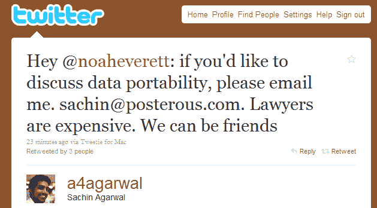

# “律师很贵。我们可以做朋友。”(@ Posterous To @ TwitPic)

> 原文：<https://web.archive.org/web/https://techcrunch.com/2010/06/30/lawyers-are-expensive-we-can-be-friends-posterous-to-twitpic/>

# “律师很贵。我们可以做朋友。”(@Posterous To @TwitPic)

[正如你昨天可能已经读过的](https://web.archive.org/web/20221006062047/https://beta.techcrunch.com/2010/06/29/twitpic-posterous-lawyers/)， [TwitPic](https://web.archive.org/web/20221006062047/http://twitpic.com/) 和 [Posterous](https://web.archive.org/web/20221006062047/http://posterous.com/) 目前正处于同一条战线上，后者推出了一个“[从 TwitPic](https://web.archive.org/web/20221006062047/http://posterous.com/switch/twitpic/) 中拯救你的照片”工具，为用户提供了一个点击方式将 TwitPic 照片导入到他们的 Posterous 博客中。

据报道，TwitPic 对这个想法不感兴趣，并在上周给 Posterous 团队发了一封信，威胁如果他们推出这个项目，将对该公司采取法律行动。

Posterous 的联合创始人 Sachin Agarwal 告诉我们 TwitPic 的声明是伪造的，并且“Posterous 只是作为拥有照片的用户的代理”。TwitPic 似乎最关心 Posterous 访问数据的方法。

但也许律师终究不是必要的。请看[这条来自 Agarwal 的推文](https://web.archive.org/web/20221006062047/http://twitter.com/a4agarwal/status/17426565148)，大约半小时前发给 TwitPic 创始人 [Noah Everett](https://web.archive.org/web/20221006062047/http://twitter.com/noaheverett) (通过 [@cdixon](https://web.archive.org/web/20221006062047/http://twitter.com/cdixon/status/17426677773) ):

> “嘿@noaheverett:如果你想讨论数据的可移植性，请给我发邮件。sachin@posterous.com。律师很贵。我们可以成为朋友”

如果一场真正的诉讼因为这条推特而被转移，这不是很好吗？

你是在看这个吗，@HTC，@诺基亚和@ceoSteveJobs(是的，我知道是假的)？