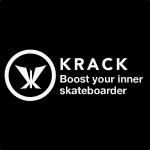
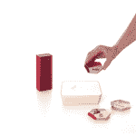
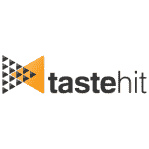

# Le Camping 第五个演示日:认识 StreamRoot、Hublo、Krack 等 

> 原文：<https://web.archive.org/web/https://techcrunch.com/2014/03/11/le-camping-5th-demo-day-meet-streamroot-hublo-krack-and-more/>

法国创业加速器 [Le Camping](https://web.archive.org/web/20221006052535/http://accelerate.numaparis.com/) 今天在巴黎 [Numa](https://web.archive.org/web/20221006052535/http://en.numaparis.com/) 展示了第五批创业公司。今天是展示日之旅的第一部分，将把 12 家初创公司带到伦敦、柏林和卢森堡。

当三年前乐露营开始的时候，法国的生态系统是非常不同的。活动不多，乐露营是法国第一批创业加速器之一。如今，要参加的活动太多了，2013 年涌现了许多新的加速器。最近，Le Camping 搬到了 Numa 的新大楼，并将计划从六个月压缩到四个月。

多年来，1000 个申请中有 62 个创业公司在 Le Camping 得到了加速，其中 88%仍然活着。乐露营创业公司多年来筹集了 1380 万美元(€1000 万)。

Le Camping 经理 Elise Nebout 讲述了几个成功的故事:Sketchfab 在 Photoshop 中有自己的[按钮](https://web.archive.org/web/20221006052535/https://beta.techcrunch.com/2014/01/21/sketchfabs-photoshop-integration-allows-you-to-share-your-3d-models-on-the-web/)，Lima [在 Kickstarter 上筹集了](https://web.archive.org/web/20221006052535/https://beta.techcrunch.com/2013/08/15/dropbox-alternative-lima-nee-plug-works-with-chromecast-breaks-into-kickstarter-tech-top-10/)超过 120 万美元，[banking '](https://web.archive.org/web/20221006052535/https://bankin.com/)有超过 100 万用户，甚至更多。要了解更多关于乐露营创业公司的信息，请前往[乐露营黑手党](https://web.archive.org/web/20221006052535/http://lecampingmafia.com/)。

下面是乐露营第五批的 12 家创业公司。

[**克拉克**](https://web.archive.org/web/20221006052535/http://krack.co/)

Krack 是一家围绕滑板的硬件创业公司。这是一个装满传感器的小盒子，你把它放在你的板子下面。它将把你现有的滑板变成一个智能板，可以与移动应用程序配合使用。当你自己学习一个新技巧的时候，没有人看见你。感谢克拉克，你的滑板体验保持社交。你可以与应用程序竞争和分享信息。它记录和检测你的把戏，它分享你的位置和更多。

[**Qleek**](https://web.archive.org/web/20221006052535/http://qleek.me/)

Qleek 是一种将所有照片、书籍等放入客厅的方式。它是 Spotify 播放列表、YouTube 频道或 Instagram feed 的物理表示。它总是最新的，可以代表网络上的任何内容。你在 Qleek 的底座上放一个 Tapp，它就开始演奏了。你可以在网上订购定制的 Tapps，几天后你就会收到邮件。该公司将出售基地，球员。它还希望与内容提供商合作，创造其他收入来源。一场众筹活动正在筹备中。

[**农业**](https://web.archive.org/web/20221006052535/http://www.agriconomie.com/)

农业经济是一个专门从事农业的市场。虽然许多农民使用他们的智能手机和现代技术来帮助他们，但仍然存在许多问题。最重要的一点是，他们必须经常接触供应商。平均来说，供应商离他们的农场有 50 公里远。Agriconomie 是一个满足您所有农业需求的电子商务网站，因此您不会浪费时间。该公司正在寻找 100 万美元(€70 万)。

[**StreamRoot**](https://web.archive.org/web/20221006052535/http://www.streamroot.io/)

StreamRoot 是一家视频流技术初创公司。在现有的解决方案中，当你播放视频时，你需要从公司的服务器上下载。这会产生带宽问题。视频公司必须与内容交付网络合作来解决这个问题。StreamRoot 是一种替代方案，因为它使用点对点技术来减轻视频公司服务器的负担。StreamRoot 降低了带宽成本，消除了流量高峰等—对等网络在高峰时段变得更加高效。前三个客户在转用 StreamRoot 后，带宽成本降低了 70%。最好的部分是你不需要安装插件。

[**广场**](https://web.archive.org/web/20221006052535/http://www.bandsquare.fr/)

BandSquare 帮助乐队和巡演经理进行盈利巡演。策划一场演唱会是一个很大的财务风险，许多艺术家不知道他们在一些城市是否有足够大的追随者。该平台迄今已帮助了 300 名艺术家。BandSquare 允许您测量需求。它将艺术家和粉丝聚集在一起，让演唱会成为可能。4 月，BandSquare 将在音乐流媒体服务 Deezer 上提供。你可以表达你对乐队的支持。

[**Tripndrive**](https://web.archive.org/web/20221006052535/https://www.tripndrive.com/en)

Tripndrive 允许您在外出时租车，而不是将车停在机场停车场。这是旅行者之间的汽车共享服务。当你租一辆汽车的时候，钱去停车场。这样，旅行的人就不必为停车付费了。这家初创公司将首先从法国的大型机场开始，然后是地区性机场。之后，该公司将把它的服务带到火车站和其他欧洲国家。

[**Hublo**](https://web.archive.org/web/20221006052535/https://www.hublo.com/)

Hublo 是一家汇率分析公司。许多客户在购买东西或创建账户之前就离开了网站。谷歌分析不是解决这个问题的合适工具。Hublo 可以为您提供解决转换问题的见解。当您打开 Hublo 的管理界面时，这是一种非常直观的体验。你不需要成为开发者。您可以浏览您自己的网站，并单击重要步骤创建帐户。之后，您将收到关于换算率的数据。

[T2**T4**](https://web.archive.org/web/20221006052535/http://www.realytics.io/)

Realytics 是一家电视广告技术初创公司。当广告商进行电视宣传时，各频道只分享总收视率。但是，当许多观众想要了解更多关于产品或服务的信息时，他们会使用平板电脑浏览网页。Realytics 把所有东西放在一起。您可以在电视广告活动期间跟踪您的网站流量，并获得更多信息。最后，Realytics 与广告客户分享个人资料。

[**Artips**](https://web.archive.org/web/20221006052535/http://www.artips.fr/)

Artips 每天都会发一个关于一件艺术杰作的机智而难忘的趣闻。这是一份免费的时事通讯。如今，该公司拥有超过 25，000 名用户。它有 65%的开放率，高于[我的小巴黎](https://web.archive.org/web/20221006052535/https://beta.techcrunch.com/2013/11/22/aufeminin-acquires-subscription-service-and-city-guide-my-little-paris-for-90-million/)。这家初创公司与 80 名投稿人合作，以确保内容准确无误。阿歇特正在出售公司的第二本书。Artips 正在开发一款免费增值的移动应用。当谈到其他收入机会时，这家初创公司将经营赞助轶事，向大公司出售白牌服务等。

 **

LocalEyes 是一个面向品牌和零售商的分析平台。大品牌必须检查他们的产品在商店里是如何展示的。例如，商店可能没有进行正确的促销。LocalEyes 与 25，000 名当地观察员合作，开展小型工作并检查产品的展示方式。一个公司可以为多个商店创建一个任务。作为一个观察者，你可以接受这份工作，并配图报道。这样，品牌可以很快知道他们是否需要联系特定的零售商来解决问题。这家初创公司目前已经筹集了 50 万美元(€36.5 万)。

[T2](https://web.archive.org/web/20221006052535/https://tastehit.com/)

TasteHit 使用机器学习进行在线购物。这是一个电子商务网站的产品推荐小工具。目前的推荐引擎每月产生 100 万条推荐，点击率为 5%。这个现收现付的小工具可以与 Prestashop、Magento 和 Shopify 一起使用。亚马逊和易贝可能有自己的推荐引擎。但 TasteHit 给所有其他商店带来了同样的体验。

[**张天翼**](https://web.archive.org/web/20221006052535/https://takes.io/)

Takes.io 是一个视频制作协作平台。它帮助制片人、导演和其他人在一个平台上一起工作。它可以在 YouTube，Vimeo，Dailymotion 上使用。除了使用电子邮件链，你还可以和客户分享一个私人的 YouTube 视频。您可以在 Takes.io 上直接评论和注释视频。例如，客户端可以从其浏览器中在视频的特定部分绘制箭头。该公司正在寻找 41.5 万美元(€30 万)。**